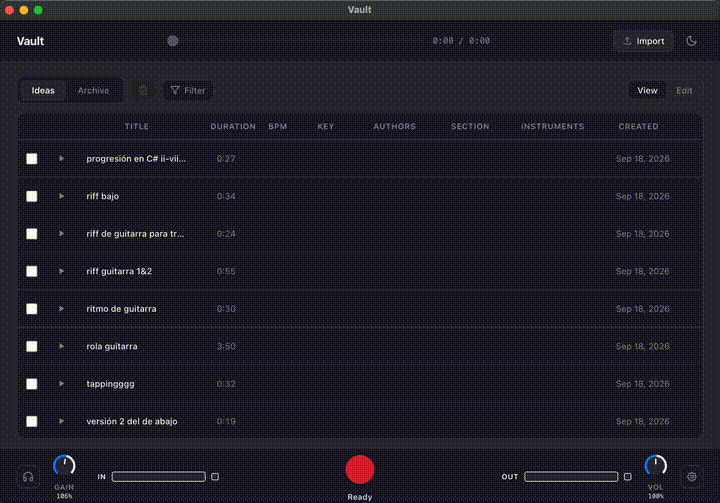

# Vault

Vault is a cross-platform desktop application for macOS and Windows designed for songwriters, producers, and musicians to capture, organize, and catalog musical voice memos and song ideas.



---

## Table of Contents

- [Overview](#overview)
- [Key Features](#key-features)
  - [Audio Recording and Dock](#audio-recording-and-dock)
  - [Ideas Catalog and Navigation](#ideas-catalog-and-navigation)
  - [Audio Playback Engine](#audio-playback-engine)
  - [Audio File Import](#audio-file-import)
  - [Metadata Management and Editing](#metadata-management-and-editing)
  - [Filtering and Organization](#filtering-and-organization)
  - [Selection and Deletion](#selection-and-deletion)
  - [Visual Design and Theming](#visual-design-and-theming)
- [Getting Started for Users](#getting-started-for-users)
  - [Recording a Musical Idea](#recording-a-musical-idea)
  - [Importing Existing Audio Files](#importing-existing-audio-files)
  - [Editing Metadata](#editing-metadata)
  - [Managing Available vs Archived Ideas](#managing-available-vs-archived-ideas)
- [Installation and Distribution](#installation-and-distribution)
  - [macOS Installation](#macos-installation)
  - [Windows Installation](#windows-installation)
  - [Handling Security Prompts for Unsigned Builds](#handling-security-prompts-for-unsigned-builds)
- [Development Guide](#development-guide)
  - [Prerequisites](#prerequisites)
  - [Setup](#setup)
  - [Running the Development Environment](#running-the-development-environment)
  - [Running Tests](#running-tests)
  - [Building and Packaging](#building-and-packaging)
- [Architecture and Tech Stack](#architecture-and-tech-stack)
- [Storage and Data Integrity](#storage-and-data-integrity)
- [License](#license)

---

## Overview

Musical inspiration happens quickly. Voice memos and short recording takes frequently end up scattered across phones, voice recorders, and desktop folders with meaningless filenames and missing musical context.

Vault solves this by providing a unified, offline desktop environment where ideas can be recorded in one click, tagged with musical metadata (BPM, key, section, instruments, authors, notes), auditioned with low-latency scrubbing, and organized into workable song catalogs.

---

## Key Features

### Audio Recording and Dock

- **Persistent Bottom Dock**: The recording dock remains accessible at the bottom of the screen across all catalog views.
- **Single-Click Capture**: Clicking the prominent red record button begins immediate capture; the button morphs into a square stop control.
- **Dual Real-Time Volume Meters**: Separate visual meters monitor microphone input levels and master output playback levels.
- **Clipping Indicator**: Visual distortion warning highlights when audio reaches 0 dB to prevent clipped takes.
- **Rotary Gain and Volume Controls**: Tactile knobs adjust input microphone sensitivity and master playback volume directly from the dock.
- **Hardware Routing Settings**: A settings dialog accessible via the gear icon allows selection of specific audio input devices, output devices, and input channels (stereo or discrete mono channels).
- **Post-Recording Metadata Modal**: Stopping a take prompts for optional attributes (Title, Musical Key, BPM, Authors, Song Section, Instruments, Notes). Leaving the title blank automatically generates sequential names ("Idea-1", "Idea-2", etc.).
- **Discard Safeguard**: Quickly discard bad takes with confirmation to avoid cluttering your library.

### Ideas Catalog and Navigation

- **Partitioned Workflow Tabs**: Separate tabs for Available (active musical ideas) and Archived (ideas marked as used in completed songs).
- **Comprehensive Metadata Columns**: Displays Play/Pause controls, Title, Duration, Musical Key, BPM, Authors, Song Section, Instrument tags, and Notes.
- **Formatted Timestamps and Durations**: Human-readable durations (mm:ss) and relative creation dates.

### Audio Playback Engine

- **Custom Streaming Protocol (`vault-audio://`)**: Audio chunks stream with HTTP range request support, enabling instantaneous seeking and scrubbing without audio buffer lags.
- **Interactive Scrubber Time Bar**: Visual progress bar showing current position, buffered audio, elapsed time, and total length.
- **Keyboard Shortcuts**: Spacebar toggles playback of the currently selected or active idea.
- **Playback Coordinator**: Prevents overlapping audio by pausing any playing track when another take is auditioned.

### Audio File Import

- **Drag-and-Drop Ingestion**: Drop single files or batches of external audio files directly onto the window.
- **Supported Formats**: WAV, MP3, M4A, OGG, and FLAC with magic-byte header validation.
- **Non-Destructive Storage**: Original source files are copied into the internal vault storage and left completely untouched on disk.
- **Automatic Duration Extraction**: Uses client-side audio metadata decoding to calculate track lengths.
- **Circular Progress Indicator**: An Apple-style circular progress ring displays real-time percentage (0% to 100%) during batch imports.

### Metadata Management and Editing

- **View and Edit Modes**: Toggle between a protected read-only View Mode and an interactive Edit Mode.
- **Inline Cell Editing**: In Edit Mode, clicking on any field (Title, Key, BPM, Authors, Section, Notes) enables instant inline editing with automatic persistence.
- **Expandable Notes Reader**: A modal dialog allows reading and editing longer lyrical notes or chords that exceed table cell boundaries.

### Filtering and Organization

- **Multi-Criteria Filter Menu**: Filter the ideas table by Instrument, Musical Key, Song Section, Authors, or Usage state.
- **Pill Badges**: Active filter criteria appear as clickable filter pills for rapid removal.
- **One-Click Reset**: "Clear all filters" button resets the table to show all records instantly.

### Selection and Deletion

- **Multi-Row Checkbox Selection**: Select individual rows, use the header checkbox to select all, or use Shift-click for contiguous range selection.
- **Safe Cascading Deletion**: Deleting ideas removes database records and safely unlinks associated audio files from disk, with a confirmation modal preventing accidental data loss.

### Visual Design and Theming

- **Apple Human Interface Guidelines**: Engineered with a clean, native aesthetic, restrained borders, and clear typographic hierarchy.
- **Light and Dark Theme**: Instant toggle between high-contrast dark and light modes, persisted across app restarts.

---

## Getting Started for Users

### Recording a Musical Idea

1. Launch Vault.
2. Locate the recording dock at the bottom of the window.
3. Click the red circular **Record** button to begin capturing audio.
4. Speak, play, or sing your idea. Monitor the left volume meter to verify signal level.
5. Click the red square **Stop** button when finished.
6. In the metadata window that appears:
   - Enter a Title (or leave blank to use the default "Idea-XX" numbering).
   - Enter optional details like Key, BPM, Song Section, and Instruments.
   - Click **Save** to add it to your catalog, or click **Discard** if you want to abort the take.

### Importing Existing Audio Files

- **Drag and Drop**: Drag one or more audio files from your file manager directly onto the Vault window.
- **Option Bar**: Click the **Import** button in the top navigation bar to choose audio files via the native file selector.

### Editing Metadata

1. Click the **Edit Mode** button in the header toolbar.
2. Click directly into any metadata cell (e.g., BPM, Key, Title, Instruments) to edit its value.
3. Press Enter or click outside the cell to save changes automatically.
4. Toggle back to **View Mode** when finished.

### Managing Available vs Archived Ideas

- When an idea is incorporated into a finished song or project, click the **Used** checkbox on that idea's row.
- The idea moves from the **Available** tab to the **Archived** tab, keeping your active workspace uncluttered.

---

## Installation and Distribution

### macOS Installation

1. Download `Vault.dmg`.
2. Double-click to mount the disk image.
3. Drag the **Vault** icon into the **Applications** shortcut.
4. Launch Vault from your Applications folder or Spotlight.

### Windows Installation (Pending)

1. Download `Vault-Setup.exe`.
2. Double-click the installer. Vault installs directly to your user application directory without requiring administrator rights.
3. Launch Vault via the desktop shortcut or the Start Menu.

### Handling Security Prompts for Unsigned Builds

Because early releases are distributed without commercial code-signing certificates, your operating system may show an initial security warning.

#### On macOS (Gatekeeper)

If macOS displays: _"Vault cannot be opened because the developer cannot be verified"_:

1. Open **Finder** and go to the **Applications** folder.
2. **Right-click** (or Control-click) on **Vault.app** and select **Open**.
3. Click **Open** in the confirmation dialog. (This is only required once).

_Terminal command alternative:_

```bash
xattr -cr /Applications/Vault.app
```

#### On Windows (SmartScreen)

If Windows Defender SmartScreen displays: _"Windows protected your PC"_:

1. Click the **More info** link in the dialog.
2. Click the **Run anyway** button.

---

## Development Guide

### Prerequisites

- Node.js 22.0.0 or higher
- npm 10.0.0 or higher
- macOS (for building macOS DMG/ZIP and icon containers) or Windows (for building Windows Setup/ZIP)

### Setup

Clone the repository and install dependencies:

```bash
git clone https://github.com/mrbanana55/Vault.git
cd Vault
npm install
```

_(The postinstall script automatically rebuilds the native SQLite module for Electron)._

### Running the Development Environment

Development mode runs Vite for hot-reloading renderer UI and Electron for the main process. Open two terminal tabs:

**Terminal 1 (Vite Dev Server):**

```bash
npm run dev:renderer
```

**Terminal 2 (Electron Main Process):**

```bash
npm start
```

### Running Tests

Execute the full automated test suite (325 unit and integration tests):

```bash
npm test
```

To run tests in watch mode during development:

```bash
npm run test:watch
```

### Building and Packaging

#### Production Build (Compiles Main and Renderer):

```bash
npm run build
```

#### Package Standalone Folder (Unpacked):

```bash
npm run package
```

Outputs unpacked standalone app directory to `out/Vault-{platform}-{arch}/`.

#### Generate Installers for Current Operating System:

```bash
npm run make
```

Outputs installers to `out/make/`.

#### Platform-Specific Maker Commands:

```bash
# macOS (.dmg and .zip)
npm run make:mac

# Windows (.exe installer and portable .zip)
npm run make:win

# Regenerate platform icons (.icns and .ico from assets/VaultLogo.png)
npm run generate:icons
```

---

## Architecture and Tech Stack

Vault enforces a strict **Process Separation** model:

```text
[ React 19 Frontend ] (Renderer Process)
        |
        |  window.vaultAPI (Context Isolation + Sandboxed Preload Bridge)
        v
[ Electron IPC Handlers ] (Main Process)
        |
   +----+--------------------------+
   |                               |
   v                               v
[ SQLite via better-sqlite3 ]   [ File System Audio Vault ]
(Metadata & Relative Paths)     (Physical Audio Files in userData)
```

- **Runtime**: Electron 35
- **Frontend Framework**: React 19, TypeScript
- **Styling**: Tailwind CSS v3, PostCSS
- **Bundler & Build**: Vite 6 (Renderer), TypeScript Compiler (Main & Preload)
- **Packaging**: Electron Forge 7.11 (`@electron-forge/maker-dmg`, `@electron-forge/maker-squirrel`, `@electron-forge/maker-zip`)
- **Persistence**: SQLite 3 via `better-sqlite3` (WAL mode enabled)
- **Audio Decoding**: Web Audio API (Renderer) and streaming Range requests (Main)
- **Testing**: Vitest 3.2, jsdom, React Testing Library

---

## Storage and Data Integrity

- **Operating System User Data**:
  - macOS: `~/Library/Application Support/Vault/`
  - Windows: `%APPDATA%\Vault\`
- **Database**: `vault.db` stores metadata and relative audio paths only. Audio files are never stored as database BLOBs.
- **Audio Files**: Stored in `audio_vault/recordings/` as unique UUID files.
- **Upgrade Safety**: Application updates, reinstalls, or packaging refreshes preserve user data located in the operating system's application support directory.

---

## License

This project is private and intended for personal and collaborative musical workflow organization.
