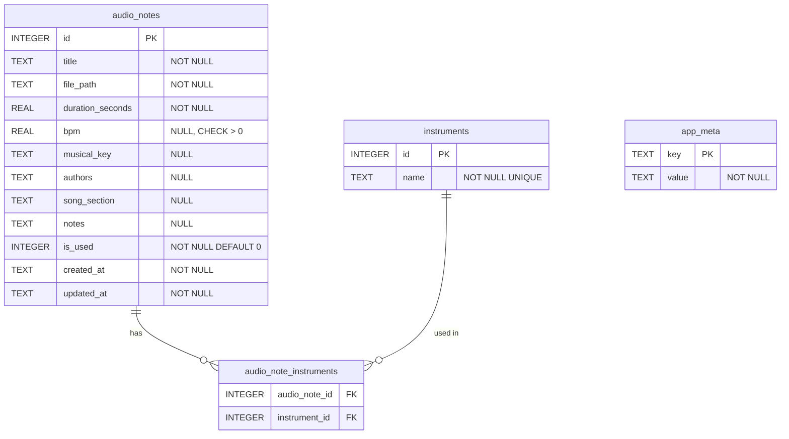

# Implementation Plan: Data Model for Audio Notes

**Spec Reference:** [`specs/001-database-schema/spec.md`](file:///Users/andresdelgado/Documents/Coding/Vault/specs/001-database-schema/spec.md)

## Goal

Implement the full SQLite persistence layer for Vault: schema, migration runner, database client, shared TypeScript types, IPC handlers, and preload bridge — everything needed for the Renderer to create, read, update, filter, and delete audio notes with instrument associations. No UI code is included in this plan.

---

## User Review Required

> **Monotonic counter approach**: FR-3 requires `idea-N` titles that never collide. This plan uses a dedicated `app_meta` key-value table with a row `next_note_number` that is atomically incremented inside the INSERT transaction. This is simpler and more reliable than `MAX(id)+1` or `COUNT(*)`. See the [Technical Decisions](#6-technical-decisions) section for alternatives considered.

> **Project bootstrapping**: Since this is a greenfield project with no `package.json` or `src/` directory yet, this plan includes initializing the project with `npm init`, installing `better-sqlite3`, `electron`, and `typescript`, and scaffolding the directory structure defined in AGENTS.md. Only the files relevant to the data layer will have meaningful content; the Electron entry point and React app will be minimal stubs.

---

## Open Questions

No open questions — all requirements were clarified during the spec interview.

---

## Proposed Changes

### 1. Project Scaffolding

Bootstrap the project and create the directory tree from AGENTS.md.

#### [NEW] `package.json`

```json
{
  "name": "vault",
  "version": "0.1.0",
  "description": "Desktop app for organizing musical ideas",
  "main": "dist/main/index.js",
  "scripts": {
    "build:main": "tsc -p tsconfig.main.json",
    "test": "vitest run",
    "test:watch": "vitest"
  },
  "devDependencies": {
    "typescript": "^5.5.0",
    "vitest": "^3.2.0",
    "electron": "^35.0.0",
    "@types/better-sqlite3": "^7.6.12",
    "@types/node": "^22.0.0"
  },
  "dependencies": {
    "better-sqlite3": "^11.8.0"
  }
}
```

#### [NEW] `tsconfig.json`

Base config with strict mode, path aliases for `@shared/*`.

```json
{
  "compilerOptions": {
    "target": "ES2022",
    "module": "commonjs",
    "moduleResolution": "node",
    "strict": true,
    "esModuleInterop": true,
    "skipLibCheck": true,
    "outDir": "dist",
    "rootDir": "src",
    "declaration": true,
    "paths": {
      "@shared/*": ["./src/shared/*"]
    }
  },
  "include": ["src/**/*"]
}
```

#### [NEW] `tsconfig.main.json`

Extends the base config, scoped to `src/main` and `src/shared`.

---

### 2. Shared Types (`src/shared/`) `[Covers FR-1, FR-2, FR-5, FR-6, FR-7, FR-8, FR-9, FR-11, FR-12]`

These types are consumed by both Main (db layer) and Renderer (via preload). No `any` used anywhere.

#### [NEW] `src/shared/types/audio-note.ts`

```typescript
/** Represents an audio note as returned from the database. */
export interface AudioNote {
  id: number;
  title: string;
  file_path: string;
  duration_seconds: number;
  bpm: number | null;
  musical_key: string | null;
  authors: string | null;
  song_section: string | null;
  notes: string | null;
  is_used: 0 | 1;
  created_at: string; // ISO 8601
  updated_at: string; // ISO 8601
}

/** Fields the user can supply when creating a new note. */
export interface CreateAudioNoteInput {
  title?: string;
  file_path: string;
  duration_seconds: number;
  bpm?: number | null;
  musical_key?: string | null;
  authors?: string | null;
  song_section?: string | null;
  notes?: string | null;
  instrument_names?: string[];
}

/** Fields the user can update on an existing note. */
export interface UpdateAudioNoteInput {
  id: number;
  title?: string;
  bpm?: number | null;
  musical_key?: string | null;
  authors?: string | null;
  song_section?: string | null;
  notes?: string | null;
  is_used?: 0 | 1;
  instrument_names?: string[];
}
```

#### [NEW] `src/shared/types/instrument.ts`

```typescript
export interface Instrument {
  id: number;
  name: string;
}
```

#### [NEW] `src/shared/types/ipc.ts`

```typescript
/** Standard IPC result envelope used by all handlers. */
export type IPCResult<T> =
  | { success: true; data: T }
  | { success: false; error: string };
```

#### [NEW] `src/shared/types/filters.ts`

```typescript
export interface NoteFilters {
  is_used?: 0 | 1;
  search?: string;
  bpm_min?: number;
  bpm_max?: number;
  musical_key?: string;
  song_section?: string;
  instrument_name?: string;
}
```

#### [NEW] `src/shared/types/index.ts`

Barrel re-export of all shared types.

---

### 3. Database Layer (`src/main/db/`) `[Covers FR-1 through FR-16, NFR-1, NFR-2, NFR-3]`

All SQLite access lives exclusively in the Main process. The database file is stored at `app.getPath('userData')/vault.db`.

#### [NEW] `src/main/db/client.ts`

Initializes a `better-sqlite3` instance with WAL mode and foreign keys enabled. Exports a singleton getter.

```typescript
import Database from "better-sqlite3";
import path from "path";

let db: Database.Database | null = null;

export function getDatabase(dbPath: string): Database.Database {
  if (!db) {
    db = new Database(dbPath);
    db.pragma("journal_mode = WAL");
    db.pragma("foreign_keys = ON");
  }
  return db;
}

export function closeDatabase(): void {
  if (db) {
    db.close();
    db = null;
  }
}
```

#### [NEW] `src/main/db/migrations/001-initial-schema.ts`

The migration creates 4 tables. Executed inside a transaction for atomicity.

```sql
-- audio_notes: core entity [FR-1, FR-2, FR-5, FR-6, FR-7, FR-8]
CREATE TABLE IF NOT EXISTS audio_notes (
  id            INTEGER PRIMARY KEY AUTOINCREMENT,
  title         TEXT    NOT NULL,                          -- [FR-1, FR-3]
  file_path     TEXT    NOT NULL,                          -- [FR-2]
  duration_seconds REAL NOT NULL,                          -- [FR-4]
  bpm           REAL    DEFAULT NULL CHECK (bpm IS NULL OR bpm > 0),  -- [FR-5, Edge:BPM]
  musical_key   TEXT    DEFAULT NULL,                      -- [FR-7]
  authors       TEXT    DEFAULT NULL,                      -- [FR-6]
  song_section  TEXT    DEFAULT NULL,                      -- [FR-7]
  notes         TEXT    DEFAULT NULL,                      -- [FR-5]
  is_used       INTEGER NOT NULL DEFAULT 0 CHECK (is_used IN (0, 1)), -- [FR-8]
  created_at    TEXT    NOT NULL DEFAULT (datetime('now')),            -- [FR-1]
  updated_at    TEXT    NOT NULL DEFAULT (datetime('now'))             -- [FR-1]
);

-- instruments: reusable catalog [FR-9]
CREATE TABLE IF NOT EXISTS instruments (
  id   INTEGER PRIMARY KEY AUTOINCREMENT,
  name TEXT    NOT NULL UNIQUE                             -- [FR-9]
);

-- Junction table for many-to-many [FR-11, FR-12]
CREATE TABLE IF NOT EXISTS audio_note_instruments (
  audio_note_id INTEGER NOT NULL REFERENCES audio_notes(id) ON DELETE CASCADE,
  instrument_id INTEGER NOT NULL REFERENCES instruments(id) ON DELETE RESTRICT,
  PRIMARY KEY (audio_note_id, instrument_id)
);

-- Monotonic counter for default titles [FR-3, Edge:Duplicate titles]
CREATE TABLE IF NOT EXISTS app_meta (
  key   TEXT PRIMARY KEY,
  value TEXT NOT NULL
);

INSERT OR IGNORE INTO app_meta (key, value) VALUES ('next_note_number', '1');
```

**Key design details:**

- `ON DELETE CASCADE` on the junction table means deleting an `audio_note` automatically removes its instrument associations `[FR-15]`.
- `ON DELETE RESTRICT` on `instrument_id` prevents accidental deletion of instruments while notes reference them — but since we never delete instruments (orphaned instruments stay per spec), this is a safety net.
- `bpm` is `REAL` to allow fractional tempos (e.g., 120.5 BPM). CHECK constraint enforces positivity `[Edge: BPM bounds]`.
- `duration_seconds` is `REAL` for sub-second precision.
- Timestamps use SQLite's `datetime('now')` which stores UTC in ISO 8601 format.

#### [NEW] `src/main/db/migrations/index.ts`

Simple migration runner that tracks applied migrations in a `_migrations` table and runs pending ones in order.

```typescript
import Database from "better-sqlite3";

interface Migration {
  id: string;
  up: (db: Database.Database) => void;
}

const migrations: Migration[] = [
  { id: "001-initial-schema", up: require("./001-initial-schema").up },
];

export function runMigrations(db: Database.Database): void {
  db.exec(`
    CREATE TABLE IF NOT EXISTS _migrations (
      id         TEXT PRIMARY KEY,
      applied_at TEXT NOT NULL DEFAULT (datetime('now'))
    );
  `);

  const applied = new Set(
    db
      .prepare("SELECT id FROM _migrations")
      .all()
      .map((row: { id: string }) => row.id),
  );

  for (const migration of migrations) {
    if (!applied.has(migration.id)) {
      db.transaction(() => {
        migration.up(db);
        db.prepare("INSERT INTO _migrations (id) VALUES (?)").run(migration.id);
      })();
    }
  }
}
```

#### [NEW] `src/main/db/note-repository.ts`

Repository module encapsulating all `audio_notes` CRUD queries. Each method maps to one or more FRs.

```typescript
// Pseudocode — full implementation will follow this contract

/** [FR-1, FR-3, FR-4, FR-5, FR-8, FR-10, FR-11] */
function createNote(input: CreateAudioNoteInput): AudioNote;

/** [FR-13, FR-14, NFR-3] */
function getNotes(filters: NoteFilters): AudioNote[];

/** Returns a single note by ID, with its instrument list */
function getNoteById(
  id: number,
): (AudioNote & { instruments: Instrument[] }) | null;

/** [FR-1] Update mutable fields + instrument associations */
function updateNote(input: UpdateAudioNoteInput): AudioNote;

/** [FR-15, FR-16] Hard delete — removes row, junction rows (CASCADE), returns file_path */
function deleteNote(id: number): { file_path: string } | null;
```

**`createNote` transaction detail** `[FR-3, FR-10]`:

```
BEGIN TRANSACTION
  1. Read next_note_number from app_meta
  2. If no title provided, set title = "idea-{next_note_number}"
  3. Increment next_note_number in app_meta (always, even if user supplied a title)
  4. INSERT into audio_notes
  5. For each instrument_name in input:
     a. INSERT OR IGNORE into instruments (name)
     b. SELECT id FROM instruments WHERE name = ?
     c. INSERT into audio_note_instruments (audio_note_id, instrument_id)
  6. Return the created note
COMMIT
```

> [!NOTE]
> The counter increments on **every** note creation (even when a title is provided) to ensure the sequence is monotonically increasing and gap-free in its progression. This prevents collisions if a user manually titles a note "idea-5" and then later relies on auto-generation.

**`getNotes` dynamic query builder** `[FR-13, FR-14, NFR-3]`:

```typescript
function getNotes(filters: NoteFilters): AudioNote[] {
  const conditions: string[] = [];
  const params: Record<string, unknown> = {};

  if (filters.is_used !== undefined) {
    conditions.push("an.is_used = :is_used");
    params[":is_used"] = filters.is_used;
  }
  if (filters.musical_key) {
    conditions.push("an.musical_key = :musical_key");
    params[":musical_key"] = filters.musical_key;
  }
  // ... other optional filters with bound params

  const where =
    conditions.length > 0 ? "WHERE " + conditions.join(" AND ") : "";

  const sql = `SELECT * FROM audio_notes an ${where} ORDER BY an.created_at DESC`;
  return db.prepare(sql).all(params) as AudioNote[];
}
```

#### [NEW] `src/main/db/instrument-repository.ts`

```typescript
/** [FR-9] List all instruments in the catalog */
function getAllInstruments(): Instrument[];

/** [FR-10] Get or create an instrument by name, returns the id */
function getOrCreateInstrument(name: string): Instrument;

/** Get instruments associated with a specific note */
function getInstrumentsByNoteId(noteId: number): Instrument[];
```

---

### 4. IPC Handlers (`src/main/ipc/`) `[Covers all FRs via delegation to repositories]`

All handlers follow the `IPCResult<T>` envelope and are registered with `ipcMain.handle`. Every handler wraps its body in `try/catch`.

#### [NEW] `src/main/ipc/note-handlers.ts`

| Channel           | Input                  | Output                                                 | FRs Covered        |
| ----------------- | ---------------------- | ------------------------------------------------------ | ------------------ |
| `notes:create`    | `CreateAudioNoteInput` | `IPCResult<AudioNote>`                                 | FR-1,3,4,5,8,10,11 |
| `notes:get-all`   | `NoteFilters`          | `IPCResult<AudioNote[]>`                               | FR-13,14           |
| `notes:get-by-id` | `number`               | `IPCResult<AudioNote & { instruments: Instrument[] }>` | FR-1               |
| `notes:update`    | `UpdateAudioNoteInput` | `IPCResult<AudioNote>`                                 | FR-1               |
| `notes:delete`    | `number`               | `IPCResult<{ file_missing: boolean }>`                 | FR-15,16           |

**Delete handler detail** `[FR-15, FR-16]`:

```typescript
ipcMain.handle(
  "notes:delete",
  async (_event, id: number): Promise<IPCResult<{ file_missing: boolean }>> => {
    try {
      const result = deleteNote(id); // returns { file_path } or null
      if (!result) {
        return { success: false, error: "Note not found" };
      }
      let fileMissing = false;
      try {
        await fs.promises.unlink(result.file_path);
      } catch (err: unknown) {
        if ((err as NodeJS.ErrnoException).code === "ENOENT") {
          fileMissing = true; // [FR-16] file already gone
        } else {
          throw err; // unexpected filesystem error
        }
      }
      return { success: true, data: { file_missing: fileMissing } };
    } catch (err: unknown) {
      return { success: false, error: (err as Error).message };
    }
  },
);
```

#### [NEW] `src/main/ipc/instrument-handlers.ts`

| Channel               | Input  | Output                    | FRs Covered |
| --------------------- | ------ | ------------------------- | ----------- |
| `instruments:get-all` | `void` | `IPCResult<Instrument[]>` | FR-9        |

---

### 5. Preload Bridge (`src/preload/`)

Exposes a typed `vaultAPI` to the Renderer via `contextBridge`.

#### [NEW] `src/preload/index.ts`

```typescript
import { contextBridge, ipcRenderer } from "electron";
import type {
  CreateAudioNoteInput,
  UpdateAudioNoteInput,
  NoteFilters,
  AudioNote,
  Instrument,
  IPCResult,
} from "@shared/types";

const vaultAPI = {
  notes: {
    create: (input: CreateAudioNoteInput): Promise<IPCResult<AudioNote>> =>
      ipcRenderer.invoke("notes:create", input),
    getAll: (filters: NoteFilters): Promise<IPCResult<AudioNote[]>> =>
      ipcRenderer.invoke("notes:get-all", filters),
    getById: (
      id: number,
    ): Promise<IPCResult<AudioNote & { instruments: Instrument[] }>> =>
      ipcRenderer.invoke("notes:get-by-id", id),
    update: (input: UpdateAudioNoteInput): Promise<IPCResult<AudioNote>> =>
      ipcRenderer.invoke("notes:update", input),
    delete: (id: number): Promise<IPCResult<{ file_missing: boolean }>> =>
      ipcRenderer.invoke("notes:delete", id),
  },
  instruments: {
    getAll: (): Promise<IPCResult<Instrument[]>> =>
      ipcRenderer.invoke("instruments:get-all"),
  },
};

contextBridge.exposeInMainWorld("vaultAPI", vaultAPI);
```

#### [NEW] `src/preload/vaultAPI.d.ts`

TypeScript declaration so the Renderer can consume `window.vaultAPI` with full type safety.

---

### 6. Minimal Stubs

These files exist solely to complete the directory structure. They contain the minimum code to make the project compile but are **not** the focus of this plan.

#### [NEW] `src/main/index.ts`

Electron entry point — creates a `BrowserWindow`, calls `runMigrations()`, and registers IPC handlers. Minimal stub.

#### [NEW] `src/main/audio/` (empty directory)

Placeholder for future audio file management code.

#### [NEW] `src/renderer/App.tsx` (stub)

Minimal React component returning a placeholder. Not part of this plan's scope.

---

## 6. Technical Decisions

### Decision 1: Monotonic counter via `app_meta` table

| Option                  | Description                                                                                                                                                                        | Verdict       |
| ----------------------- | ---------------------------------------------------------------------------------------------------------------------------------------------------------------------------------- | ------------- |
| **`app_meta` KV table** | A dedicated row `next_note_number` incremented in the same transaction as `INSERT`. Simple, atomic, survives deletions.                                                            | ✅ **Chosen** |
| `MAX(id) + 1`           | Fails after deletions — if note 5 is deleted, next auto-title could collide with a future ID.                                                                                      | ❌ Rejected   |
| `AUTOINCREMENT` reuse   | SQLite's `sqlite_sequence` table tracks the highest ever `ROWID`, but relying on internal implementation details is fragile and couples title generation to primary key semantics. | ❌ Rejected   |
| UUID-based titles       | `idea-a3f2…` is not user-friendly.                                                                                                                                                 | ❌ Rejected   |

### Decision 2: Authors as free-text vs. JSON array

| Option                  | Description                                                                                                              | Verdict       |
| ----------------------- | ------------------------------------------------------------------------------------------------------------------------ | ------------- |
| **Single TEXT column**  | User types "John, Paul" as plain text. Simple, spec says no author catalog.                                              | ✅ **Chosen** |
| JSON array column       | `["John", "Paul"]` — adds parsing complexity for no benefit since there's no author catalog or per-author querying need. | ❌ Rejected   |
| Normalized author table | Spec explicitly excludes an author catalog.                                                                              | ❌ Rejected   |

### Decision 3: `better-sqlite3` synchronous API

| Option                      | Description                                                                                                                                        | Verdict       |
| --------------------------- | -------------------------------------------------------------------------------------------------------------------------------------------------- | ------------- |
| **`better-sqlite3` (sync)** | Recommended by AGENTS.md. Synchronous API simplifies transaction handling. Runs in the Main process where blocking is acceptable for local DB ops. | ✅ **Chosen** |
| `sql.js` (WASM)             | Runs in Renderer but violates process separation rules.                                                                                            | ❌ Rejected   |
| `knex` / `drizzle` ORM      | Adds unnecessary dependency; constitution says no extra deps without approval.                                                                     | ❌ Rejected   |

### Decision 4: Migration system — hand-rolled vs. library

| Option                           | Description                                                                                           | Verdict       |
| -------------------------------- | ----------------------------------------------------------------------------------------------------- | ------------- |
| **Hand-rolled migration runner** | A `_migrations` table + ordered array of migration functions. ~30 lines of code, no extra dependency. | ✅ **Chosen** |
| `umzug` / `knex migrate`         | Extra dependency, overkill for a single-user desktop app.                                             | ❌ Rejected   |

### Decision 5: Test framework

| Option           | Description                                                                                                                        | Verdict       |
| ---------------- | ---------------------------------------------------------------------------------------------------------------------------------- | ------------- |
| **Vitest**       | Fast, TypeScript-native, no extra config. Works well for unit testing the DB layer with an in-memory or temp-file SQLite database. | ✅ **Chosen** |
| Jest             | Heavier config, slower.                                                                                                            | ❌ Rejected   |
| Node test runner | Built-in but less ergonomic for assertion patterns.                                                                                | ❌ Rejected   |

---

## Entity Relationship Diagram



---

## FR Coverage Matrix

| FR    | Covered By                                              |
| ----- | ------------------------------------------------------- |
| FR-1  | `audio_notes` table schema, `AudioNote` type            |
| FR-2  | `file_path TEXT` column, no BLOB columns                |
| FR-3  | `app_meta.next_note_number` + `createNote` transaction  |
| FR-4  | `duration_seconds` column, `createNote` input contract  |
| FR-5  | `DEFAULT NULL` on optional columns                      |
| FR-6  | `authors TEXT` single column                            |
| FR-7  | `musical_key TEXT`, `song_section TEXT` — unconstrained |
| FR-8  | `is_used INTEGER DEFAULT 0`                             |
| FR-9  | `instruments` table with `UNIQUE(name)`                 |
| FR-10 | `getOrCreateInstrument()` in `createNote` transaction   |
| FR-11 | `audio_note_instruments` junction table                 |
| FR-12 | Junction table — many-to-many                           |
| FR-13 | `ORDER BY created_at DESC` in `getNotes()`              |
| FR-14 | `is_used` filter in `getNotes()`                        |
| FR-15 | `ON DELETE CASCADE` + `fs.unlink` in delete handler     |
| FR-16 | `ENOENT` catch in delete handler                        |

---

## Verification Plan

### Automated Tests

All tests use a **temporary SQLite file** (not in-memory) created via `tmp` in the test setup, deleted in teardown. This mirrors real behavior including file system interactions.

**Test file:** `src/main/db/__tests__/note-repository.test.ts`

| Test Case                                                                        | Verifies            |
| -------------------------------------------------------------------------------- | ------------------- |
| Create note with all fields → returns complete `AudioNote`                       | FR-1, FR-4, FR-5    |
| Create note without title → title is `idea-1`                                    | FR-3                |
| Create 3 notes, delete middle, create another → title is `idea-4` (not `idea-3`) | FR-3, Edge: counter |
| Create note with `bpm: -10` → throws error                                       | Edge: BPM bounds    |
| Create note with `bpm: null` → succeeds                                          | FR-5                |
| Create note with instrument names → instruments created in catalog               | FR-10, FR-11        |
| Create two notes with same instrument → only one instrument row                  | FR-9                |
| Get notes with `is_used: 0` filter → only available notes returned               | FR-14               |
| Get notes default order → most recent first                                      | FR-13               |
| Delete note → row gone, junction rows gone                                       | FR-15               |
| Delete note → instrument remains in catalog (orphaned)                           | Edge: orphaned      |
| Update note `is_used` from 0 to 1 → persisted                                    | FR-8                |
| All optional fields set to null → stored as null, not empty string               | Edge: null vs empty |

**Test file:** `src/main/db/__tests__/instrument-repository.test.ts`

| Test Case                                         | Verifies |
| ------------------------------------------------- | -------- |
| `getOrCreateInstrument("Guitar")` twice → same id | FR-9     |
| `getAllInstruments()` → returns full catalog      | FR-9     |
| Instrument name uniqueness is case-sensitive      | FR-9     |

**Test file:** `src/main/db/__tests__/migrations.test.ts`

| Test Case                                               | Verifies         |
| ------------------------------------------------------- | ---------------- |
| Running migrations on fresh DB → all tables exist       | Schema           |
| Running migrations twice → idempotent                   | Migration runner |
| `app_meta` has `next_note_number = '1'` after migration | FR-3             |

**Command:**

```bash
npm test
```

### Manual Verification

1. Start the Electron app (`npm start`).
2. Open DevTools and use `window.vaultAPI.notes.create(...)` to:
   - Create a note without a title → verify it becomes `idea-1`.
   - Create a note with instruments `["Guitar", "Piano"]` → verify both appear in `window.vaultAPI.instruments.getAll()`.
   - Create another note without a title → verify it becomes `idea-2`.
3. Call `window.vaultAPI.notes.getAll({ is_used: 0 })` → verify filtering.
4. Call `window.vaultAPI.notes.delete(1)` → verify the note and its junction rows are gone, but the instruments remain.
