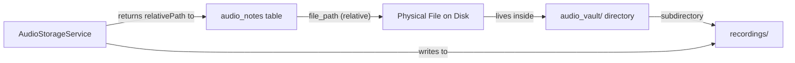

# Data Model: Audio I/O Management

**Date**: 2026-09-02 | **Spec**: [spec.md](file:///Users/andresdelgado/Documents/Coding/Vault/specs/002-audio-io-management/spec.md)

## Entities

This spec does not introduce new database tables. It operates on top of the `audio_notes` table defined in Spec 001 and manages the physical files that the `file_path` column references.

### New Shared Types (src/shared/types/audio.ts)

#### AudioFormat (union type)

Represents the set of accepted audio file extensions.

| Value   | Description          |
|---------|----------------------|
| `wav`   | Waveform Audio File  |
| `mp3`   | MPEG Layer 3         |
| `m4a`   | MPEG-4 Audio         |
| `ogg`   | Ogg Vorbis           |
| `flac`  | Free Lossless Audio  |

#### AudioIngestionResult

Return type for both recording-write and import-copy operations.

| Field            | Type     | Description                                    |
|------------------|----------|------------------------------------------------|
| `relativePath`   | `string` | Relative path stored in DB (e.g., `recordings/{uuid}.wav`) |
| `absolutePath`   | `string` | Full resolved path on disk                     |
| `format`         | `AudioFormat` | Validated format of the ingested file       |
| `sizeBytes`      | `number` | File size in bytes after write/copy            |

#### AudioValidationError

Structured error for validation failures.

| Field     | Type     | Description                                          |
|-----------|----------|------------------------------------------------------|
| `code`    | `string` | Error code: `UNSUPPORTED_EXTENSION`, `HEADER_MISMATCH`, `FILE_UNREADABLE` |
| `message` | `string` | Human-readable error description                     |

## Entity Relationships

## Validation Rules

1. **Extension whitelist**: Only `wav`, `mp3`, `m4a`, `ogg`, `flac` are accepted. Checked first, before any file I/O.
2. **Header verification**: The first N bytes of the file must match the expected magic bytes for the claimed extension (see research.md R1).
3. **Path containment**: All resolved paths must remain within `audio_vault/` base directory (see research.md R3).
4. **Filename uniqueness**: All ingested files receive UUID-based names (see research.md R2).

## State Transitions

No state machine applies. Audio files have a simple lifecycle:

1. **Ingested** → file written to `recordings/{uuid}.{ext}`, relative path stored in DB
2. **Referenced** → file served via `vault-audio://` protocol for playback (future spec)
3. **Deleted** → DB row removed, physical file unlinked from disk
