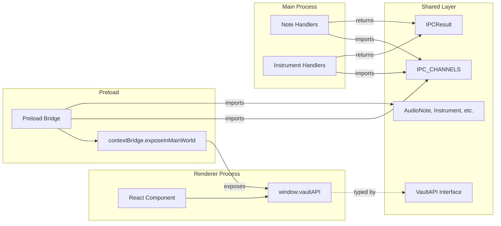

# Data Model: IPC Bridge & Contracts

**Feature**: 003-ipc-bridge-contracts
**Date**: 2026-09-03

This feature does not introduce new database entities or modify the existing SQLite schema. It operates entirely at the TypeScript type system and runtime IPC layer. The "data model" for this feature is the set of shared type contracts and the channel registry.

## Entities (Existing — Referenced, Not Modified)

The IPC bridge transports these entities across the process boundary. All are already defined in `src/shared/types/` by Specs 001 and 002.

### AudioNote

| Field | Type | Nullable | Source |
|-------|------|----------|--------|
| id | number | No | [audio-note.ts](file:///Users/andresdelgado/Documents/Coding/Vault/src/shared/types/audio-note.ts#L3) |
| title | string | No | [audio-note.ts](file:///Users/andresdelgado/Documents/Coding/Vault/src/shared/types/audio-note.ts#L4) |
| file_path | string | No | [audio-note.ts](file:///Users/andresdelgado/Documents/Coding/Vault/src/shared/types/audio-note.ts#L5) |
| duration_seconds | number | No | [audio-note.ts](file:///Users/andresdelgado/Documents/Coding/Vault/src/shared/types/audio-note.ts#L6) |
| bpm | number \| null | Yes | [audio-note.ts](file:///Users/andresdelgado/Documents/Coding/Vault/src/shared/types/audio-note.ts#L7) |
| musical_key | string \| null | Yes | [audio-note.ts](file:///Users/andresdelgado/Documents/Coding/Vault/src/shared/types/audio-note.ts#L8) |
| authors | string \| null | Yes | [audio-note.ts](file:///Users/andresdelgado/Documents/Coding/Vault/src/shared/types/audio-note.ts#L9) |
| song_section | string \| null | Yes | [audio-note.ts](file:///Users/andresdelgado/Documents/Coding/Vault/src/shared/types/audio-note.ts#L10) |
| notes | string \| null | Yes | [audio-note.ts](file:///Users/andresdelgado/Documents/Coding/Vault/src/shared/types/audio-note.ts#L11) |
| is_used | 0 \| 1 | No | [audio-note.ts](file:///Users/andresdelgado/Documents/Coding/Vault/src/shared/types/audio-note.ts#L12) |
| created_at | string (ISO 8601) | No | [audio-note.ts](file:///Users/andresdelgado/Documents/Coding/Vault/src/shared/types/audio-note.ts#L13) |
| updated_at | string (ISO 8601) | No | [audio-note.ts](file:///Users/andresdelgado/Documents/Coding/Vault/src/shared/types/audio-note.ts#L14) |

### Instrument

| Field | Type | Nullable | Source |
|-------|------|----------|--------|
| id | number | No | [instrument.ts](file:///Users/andresdelgado/Documents/Coding/Vault/src/shared/types/instrument.ts#L2) |
| name | string | No | [instrument.ts](file:///Users/andresdelgado/Documents/Coding/Vault/src/shared/types/instrument.ts#L3) |

### IPCResult\<T\>

Discriminated union envelope wrapping all handler responses:

| Variant | Fields |
|---------|--------|
| Success | `{ success: true; data: T }` |
| Failure | `{ success: false; error: string }` |

Source: [ipc.ts](file:///Users/andresdelgado/Documents/Coding/Vault/src/shared/types/ipc.ts#L1-L4)

## New Contracts (Introduced by This Feature)

### IPC Channel Registry

A typed constant object mapping domain namespaces to channel string literals:

```
IPC_CHANNELS
├── NOTES
│   ├── CREATE       → "notes:create"
│   ├── GET_ALL      → "notes:get-all"
│   ├── GET_BY_ID    → "notes:get-by-id"
│   ├── UPDATE       → "notes:update"
│   └── DELETE       → "notes:delete"
└── INSTRUMENTS
    └── GET_ALL      → "instruments:get-all"
```

**Validation rules**:
- All values are `string` literals (enforced by `as const`)
- Channel format: `{domain}:{action}` using kebab-case for multi-word actions
- No duplicate channel values across domains

### VaultAPI Interface

The bridge surface exposed to the Renderer. Maps 1:1 with the channel registry:

```
VaultAPI
├── notes
│   ├── create(input: CreateAudioNoteInput) → Promise<IPCResult<AudioNote>>
│   ├── getAll(filters?: NoteFilters) → Promise<IPCResult<AudioNote[]>>
│   ├── getById(id: number) → Promise<IPCResult<AudioNote & { instruments: Instrument[] }>>
│   ├── update(input: UpdateAudioNoteInput) → Promise<IPCResult<AudioNote>>
│   └── delete(id: number) → Promise<IPCResult<{ file_missing: boolean }>>
└── instruments
    └── getAll() → Promise<IPCResult<Instrument[]>>
```

### toErrorMessage Utility

Coerces any `unknown` value to a human-readable error string:

| Input Type | Output |
|------------|--------|
| `Error` | `err.message` |
| `string` | The string itself |
| Other | `String(err)` |

## Relationships


