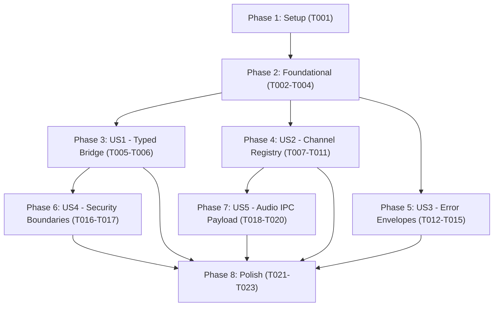

# Tasks: IPC Bridge & Contracts

**Input**: Design documents from `specs/003-ipc-bridge-contracts/`
**Prerequisites**: [plan.md](file:///Users/andresdelgado/Documents/Coding/Vault/specs/003-ipc-bridge-contracts/plan.md), [spec.md](file:///Users/andresdelgado/Documents/Coding/Vault/specs/003-ipc-bridge-contracts/spec.md), [research.md](file:///Users/andresdelgado/Documents/Coding/Vault/specs/003-ipc-bridge-contracts/research.md), [data-model.md](file:///Users/andresdelgado/Documents/Coding/Vault/specs/003-ipc-bridge-contracts/data-model.md), [contracts/ipc-contract.md](file:///Users/andresdelgado/Documents/Coding/Vault/specs/003-ipc-bridge-contracts/contracts/ipc-contract.md), [quickstart.md](file:///Users/andresdelgado/Documents/Coding/Vault/specs/003-ipc-bridge-contracts/quickstart.md)
**Constitution Constraint**: Every core IPC channel and preload bridge method must have automated tests passing cleanly before merge (Constitution § Core Principles).

## Format: `[ID] [P?] [Story] Description with file path`

- **[P]**: Can run in parallel (different files, no dependencies on incomplete tasks)
- **[Story]**: Which user story this task belongs to (`[US1]`, `[US2]`, `[US3]`, `[US4]`, `[US5]`)
- Every task includes exact file paths

---

## Phase 1: Setup (Shared Infrastructure)

**Purpose**: Verify development and test infrastructure for IPC contract refactoring

- [x] T001 Verify test runner and path alias configuration for IPC contracts in vitest.config.ts and tsconfig.main.json

---

## Phase 2: Foundational (Blocking Prerequisites)

**Purpose**: Core contract definitions and shared types that MUST be complete before ANY user story can be implemented

**⚠️ CRITICAL**: All user story work depends on these shared contract foundations.

- [x] T002 [P] Define centralized IPC_CHANNELS registry object with as const literal types in src/shared/ipc-channels.ts
- [x] T003 [P] Define VaultAPI interface and global Window interface augmentation in src/shared/types/vault-api.ts
- [x] T004 Re-export IPC_CHANNELS and VaultAPI in src/shared/types/index.ts and remove deprecated src/preload/vaultAPI.d.ts

**Checkpoint**: Shared contracts are exported and ready for consumption by Main and Preload processes.

---

## Phase 3: User Story 1 - Renderer Calls Main-Process Operations Through a Typed Bridge (Priority: P1) 🎯 MVP

**Goal**: Expose a typed `window.vaultAPI` interface via `contextBridge` that guarantees compile-time typing and returns predictable `IPCResult<T>` envelopes for all note and instrument operations.

**Independent Test**: Import `VaultAPI` in a test or renderer file, call `window.vaultAPI.notes.getAll()`, and verify the response conforms to `IPCResult<AudioNote[]>` at both compile time and runtime.

### Tests for User Story 1 ⚠️

- [x] T005 [P] [US1] Update bridge tests in src/preload/__tests__/preload.test.ts to verify all 6 vaultAPI methods call ipcRenderer.invoke and return typed IPCResult promises

### Implementation for User Story 1

- [x] T006 [US1] Refactor src/preload/index.ts to implement and expose vaultAPI strictly typed against the shared VaultAPI interface

**Checkpoint**: `window.vaultAPI` is fully typed and verified through Preload unit tests.

---

## Phase 4: User Story 2 - Channel Names Are Defined in a Single Source of Truth (Priority: P1)

**Goal**: Eliminate hardcoded IPC channel string literals across Main handlers and Preload bridge by referencing the centralized `IPC_CHANNELS` constants everywhere.

**Independent Test**: Verify via code analysis (`grep`) that zero raw channel string literals (`'notes:'`, `'instruments:'`) exist in handler registration or invoke calls, and all tests pass using the constants.

### Tests for User Story 2 ⚠️

- [x] T007 [P] [US2] Update handler registration test assertions in src/main/ipc/__tests__/ipc-handlers.test.ts to use IPC_CHANNELS constants instead of string literals
- [x] T008 [P] [US2] Update preload bridge test assertions in src/preload/__tests__/preload.test.ts to use IPC_CHANNELS constants

### Implementation for User Story 2

- [x] T009 [P] [US2] Refactor note handlers in src/main/ipc/note-handlers.ts to register handlers using IPC_CHANNELS.NOTES.* constants
- [x] T010 [P] [US2] Refactor instrument handlers in src/main/ipc/instrument-handlers.ts to register handlers using IPC_CHANNELS.INSTRUMENTS.GET_ALL constant
- [x] T011 [US2] Refactor bridge invoke calls in src/preload/index.ts to reference IPC_CHANNELS.* constants

**Checkpoint**: Main process and Preload communicate strictly via shared `IPC_CHANNELS` constants with zero string literal duplication.

---

## Phase 5: User Story 3 - Main-Process Handlers Return Consistent Error Envelopes (Priority: P1)

**Goal**: Ensure every Main-process IPC handler catches all exceptions (including non-Error throws) and safely returns a typed `{ success: false, error: string }` envelope without crashing or leaking stack traces.

**Independent Test**: Invoke handlers with invalid parameters (e.g. non-existent note ID or triggering unexpected errors) and confirm the response is `{ success: false, error: string }` rather than an unhandled rejection.

### Tests for User Story 3 ⚠️

- [x] T012 [P] [US3] Add unit tests in src/main/ipc/__tests__/ipc-handlers.test.ts verifying error envelope formatting and non-Error throw coercion across all handlers

### Implementation for User Story 3

- [x] T013 [P] [US3] Implement toErrorMessage error coercion utility in src/shared/types/ipc.ts
- [x] T014 [P] [US3] Update catch blocks in src/main/ipc/note-handlers.ts to use toErrorMessage for safe error string extraction
- [x] T015 [P] [US3] Update catch blocks in src/main/ipc/instrument-handlers.ts to use toErrorMessage for safe error string extraction

**Checkpoint**: All IPC handlers guarantee structured `IPCResult<T>` error envelopes for any runtime failure.

---

## Phase 6: User Story 4 - Preload Script Enforces Security Boundaries (Priority: P2)

**Goal**: Guarantee context isolation and node integration settings prevent any leakage of Electron or Node.js internals (`ipcRenderer`, `require`, `process`) into the Renderer context.

**Independent Test**: Verify `BrowserWindow` configuration specifies `contextIsolation: true` and `nodeIntegration: false`, and that only `vaultAPI` is exposed via `contextBridge.exposeInMainWorld`.

### Tests for User Story 4 ⚠️

- [x] T016 [P] [US4] Add security boundary tests in src/preload/__tests__/preload.test.ts asserting contextBridge.exposeInMainWorld is called exclusively for vaultAPI

### Implementation for User Story 4

- [x] T017 [US4] Verify and validate webPreferences configuration in src/main/index.ts ensuring contextIsolation: true, nodeIntegration: false, and no prototype pollution

**Checkpoint**: Preload security boundary strictly verified; Renderer has zero access to Electron/Node internals.

---

## Phase 7: User Story 5 - Audio Payload Travels Securely Over IPC (Priority: P2)

**Goal**: Enforce strict binary typing for audio ingestion so that recorded audio payloads travel across IPC as `ArrayBuffer` and are converted to `Buffer` in Main without truncation or data loss.

**Independent Test**: Send an `ArrayBuffer` payload through the ingestion pipeline and verify byte-count and content equality between sent `ArrayBuffer` and received `Buffer`.

### Tests for User Story 5 ⚠️

- [x] T018 [P] [US5] Add unit tests in src/main/ipc/__tests__/ipc-handlers.test.ts verifying ArrayBuffer audio payload handling and Buffer conversion

### Implementation for User Story 5

- [x] T019 [P] [US5] Update audio contract interfaces in src/shared/types/audio.ts and src/shared/types/vault-api.ts to explicitly type audio binary payloads as ArrayBuffer
- [x] T020 [US5] Implement ArrayBuffer validation and Buffer conversion in src/main/ipc/note-handlers.ts

**Checkpoint**: Binary audio ingestion is strictly typed as `ArrayBuffer` over IPC and safely handled by Main.

---

## Phase 8: Polish & Cross-Cutting Concerns

**Purpose**: End-to-end verification, linting, and contract validation across all user stories

- [x] T021 [P] Scan codebase with grep to confirm zero raw channel strings remain in src/main/ipc/ and src/preload/ per SC-001
- [x] T022 [P] Run TypeScript type checks across both project configurations via tsconfig.json and tsconfig.main.json
- [x] T023 Run full Vitest test suite and execute validation scenarios defined in specs/003-ipc-bridge-contracts/quickstart.md

---

## Dependencies & Execution Order

### Phase Dependencies



### User Story Dependencies

- **User Story 1 (P1)**: Depends only on Foundational (Phase 2). Can be delivered as the initial MVP bridge.
- **User Story 2 (P1)**: Depends on Foundational (Phase 2). Eliminates string literals across Main and Preload.
- **User Story 3 (P1)**: Depends on Foundational (Phase 2). Standardizes error coercion across all handlers.
- **User Story 4 (P2)**: Depends on US1 (Phase 3). Hardens the Preload bridge exposed in US1.
- **User Story 5 (P2)**: Depends on US2 (Phase 4). Extends the typed contracts to binary `ArrayBuffer` audio payloads.

### Within Each User Story

- Tests written first (red-green-refactor cycle)
- Types and contracts defined before handler implementation
- Handler implementation before bridge integration
- Unit tests passing before marking story complete

### Parallel Opportunities

- **Phase 2 (Foundational)**: T002 (`ipc-channels.ts`) and T003 (`vault-api.ts`) can run concurrently.
- **Phase 4 (US2)**: T007 (Main tests), T008 (Preload tests), T009 (`note-handlers.ts`), and T010 (`instrument-handlers.ts`) can run concurrently.
- **Phase 5 (US3)**: T012 (Tests), T013 (`toErrorMessage` in `ipc.ts`), T014 (`note-handlers.ts`), and T015 (`instrument-handlers.ts`) can run concurrently once T013 is in place.
- **Phase 8 (Polish)**: T021 (grep scan) and T022 (type check) can run concurrently.

---

## Parallel Example: User Story 2

```bash
# Concurrently update handlers for different domains:
Task: "T009 [P] [US2] Refactor note handlers in src/main/ipc/note-handlers.ts to use IPC_CHANNELS.NOTES.* constants"
Task: "T010 [P] [US2] Refactor instrument handlers in src/main/ipc/instrument-handlers.ts to use IPC_CHANNELS.INSTRUMENTS.GET_ALL constant"

# Concurrently update test suites:
Task: "T007 [P] [US2] Update handler registration test assertions in src/main/ipc/__tests__/ipc-handlers.test.ts"
Task: "T008 [P] [US2] Update preload bridge test assertions in src/preload/__tests__/preload.test.ts"
```

---

## Implementation Strategy

### MVP First (User Story 1 Only)

1. Complete Phase 1: Setup (T001)
2. Complete Phase 2: Foundational (T002 - T004)
3. Complete Phase 3: User Story 1 (T005 - T006)
4. **STOP and VALIDATE**: Run `npm test src/preload` and verify `window.vaultAPI` interface
5. Deliver MVP typed bridge

### Incremental Delivery

1. Setup + Foundational → Contracts ready in `@shared/types`
2. Add US1 → Typed bridge functional (MVP!)
3. Add US2 → Channel strings unified under single source of truth
4. Add US3 → Robust exception handling and error envelope safety
5. Add US4 → Security boundary verified and locked down
6. Add US5 → Binary audio payload handling typed as `ArrayBuffer`
7. Polish → Zero literals, 100% type checks, all validation scenarios green

---

## Notes

- All tasks use strict checklist format: `- [ ] [TaskID] [P?] [Story?] Description with file path`
- Every IPC handler must catch exceptions and return `IPCResult<T>` (Constitution § Unified IPC Contract)
- No `any` types permitted anywhere in new or refactored code (Constitution § Code Standards)
