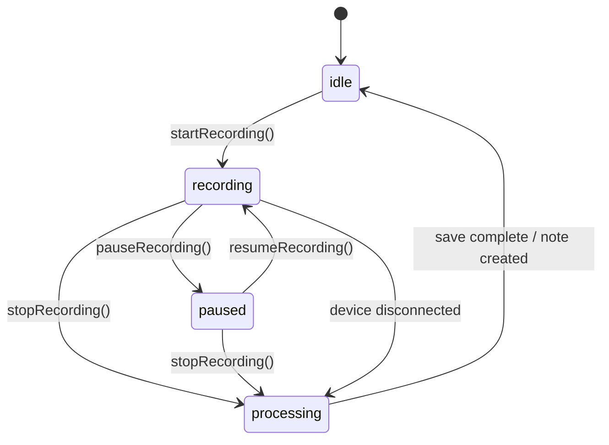
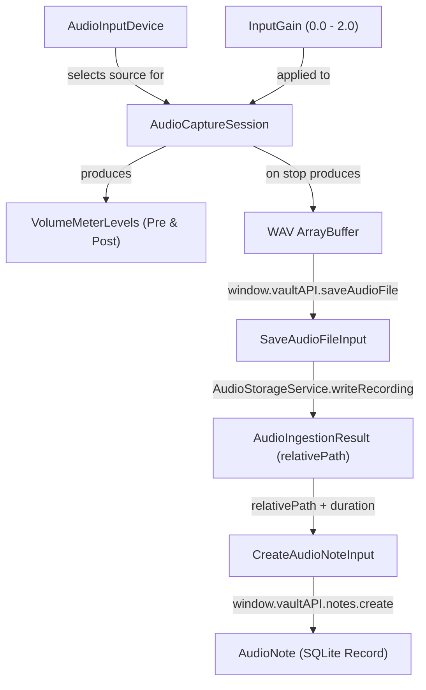

# Data Model: Audio Capture & Real-Time Recording

**Feature**: 004-audio-capture  
**Date**: 2026-09-03  

This feature introduces frontend-domain types for hardware input device enumeration, recording lifecycle states, dual volume metering, and an extended IPC transfer payload. No SQLite schema migrations are required because metadata and audio relative paths reuse the existing `audio_notes` table and `AudioStorageService` disk layout established in Specs 001 and 002.

---

## 1. Domain Entities & Interfaces

### AudioInputDevice
Represents a physical or virtual audio input hardware source enumerated from the host operating system.

| Field | Type | Description |
|---|---|---|
| `deviceId` | `string` | Unique hardware device identifier assigned by the host/browser runtime |
| `label` | `string` | Human-readable device name (e.g., `"MacBook Pro Microphone"`, `"Scarlett 2i2 USB"`) |
| `isDefault` | `boolean` | Flag indicating whether this is the system default input source |

```typescript
export interface AudioInputDevice {
  deviceId: string;
  label: string;
  isDefault: boolean;
}
```

---

### RecordingState
State machine representing the real-time lifecycle of the audio recording session.

```typescript
export type RecordingState = 'idle' | 'recording' | 'paused' | 'processing';

export const RECORDING_STATES: readonly RecordingState[] = [
  'idle',
  'recording',
  'paused',
  'processing',
] as const;
```

#### State Transition Diagram


---

### VolumeMeterLevels
Real-time signal measurements calculated by the dual `AnalyserNode` monitoring loop.

| Field | Type | Range | Description |
|---|---|---|---|
| `preGainRms` | `number` | `0.0` - `1.0` | Root Mean Square power of the raw incoming signal |
| `preGainPeak` | `number` | `0.0` - `1.0` | Maximum absolute sample value of raw input |
| `postGainRms` | `number` | `0.0` - `1.0` | Root Mean Square power after user gain is applied |
| `postGainPeak` | `number` | `0.0` - `1.0` | Maximum absolute sample value after gain |
| `isClipping` | `boolean` | `true \| false` | True when `postGainPeak >= 0.99` |

```typescript
export interface VolumeMeterLevels {
  preGainRms: number;
  preGainPeak: number;
  postGainRms: number;
  postGainPeak: number;
  isClipping: boolean;
}
```

---

### InputGain
Represents the user's adjustable recording gain setting.

| Attribute | Value | Description |
|---|---|---|
| Range | `0.0` to `2.0` | Scaled multiplier (0% to 200% volume) |
| Default | `1.0` | Unity gain (100%, unattenuated and unamplified) |
| Storage | `localStorage['vault_input_gain']` | Persisted across app restarts |

---

### SaveAudioFileInput
IPC payload passed from Renderer across the preload bridge to save a recorded audio buffer to disk.

```typescript
export interface SaveAudioFileInput {
  buffer: ArrayBuffer;
  format?: AudioFormat; // defaults to 'wav'
}
```

---

## 2. Relationships to Existing Entities


