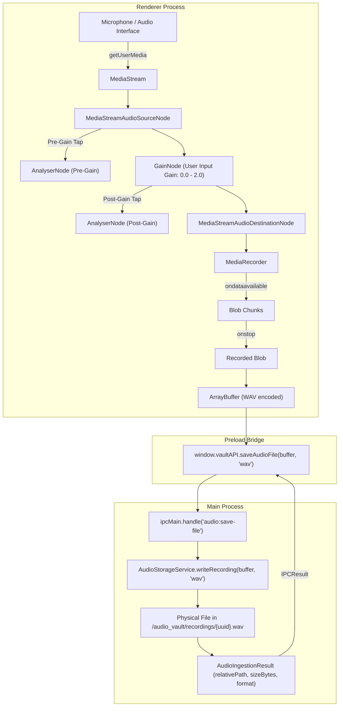

# Research: Audio Capture & Real-Time Recording

**Feature**: 004-audio-capture  
**Date**: 2026-09-03  
**Status**: Completed  

---

## 1. Audio Capture Pipeline in Renderer (Process Separation)

### Decision
Implement the entire audio capture, volume metering, input gain adjustment, and binary preparation pipeline inside the Renderer process using standard Web Audio API (`AudioContext`, `MediaStreamAudioSourceNode`, `GainNode`, `AnalyserNode`, `MediaStreamAudioDestinationNode`) and the MediaStream Recording API (`MediaRecorder`).

### Rationale
- **Constitution Compliance**: The Vault Constitution mandates:
  - *Process Separation*: UI logic and microphone capture (`navigator.mediaDevices.getUserMedia`) reside exclusively in Renderer. File system access stays in Main.
  - *Audio Processing Delegation*: "Audio duration and peak calculation for visual waveforms must be extracted at capture time within the Renderer via the Web Audio API prior to dispatching creation payloads to Main."
- **Low Latency & High Responsiveness**: Metering at 60 FPS in Renderer avoids high-frequency IPC traffic between Main and Renderer.
- **Clean Handoff**: Renderer serializes recorded audio into an `ArrayBuffer` and passes it across the preload bridge via `window.vaultAPI.saveAudioFile(buffer, format)`.

### Architecture Diagram

---

## 2. Audio Format & WAV Packaging

### Decision
Package captured audio as 16-bit linear PCM WAV (`audio/wav`) in the Renderer before dispatching to IPC.

### Rationale
- **Header Validation**: Main process `AudioStorageService` validates magic byte headers using `validateAudioHeader(buffer, 'wav')` (checks for `RIFF....WAVE`).
- **Lossless Fidelity**: Preserves musical ideas without compression artifacts.
- **Zero Third-Party Dependencies**: Standard 44-byte WAV header generation and PCM quantization can be implemented in ~40 lines of pure TypeScript with `DataView` without adding npm dependencies, satisfying the Stack Simplicity principle.

### Alternatives Considered
- `audio/webm;codecs=opus`: Native output of Chromium's `MediaRecorder`, but `AudioStorageService` does not currently whitelist `webm` in `SUPPORTED_AUDIO_FORMATS` (`wav`, `mp3`, `m4a`, `ogg`, `flac`). Decoding the recorded chunks via `AudioContext.decodeAudioData()` and encoding to PCM WAV ensures 100% compatibility with existing validation.

---

## 3. Dual Volume Metering (Pre-Gain & Post-Gain)

### Decision
Use two `AnalyserNode` instances configured with `fftSize = 256` or `512` and calculate root-mean-square (RMS) and peak signal amplitude at 30–60 FPS using `requestAnimationFrame`.

### Calculations
- **Peak**: $\max(|sample_i|)$ across the time-domain buffer.
- **RMS**: $\sqrt{\frac{1}{N} \sum_{i=1}^N sample_i^2}$.
- **Clipping Detection**: Flagged when peak amplitude $\ge 0.99$ (or $0 \text{ dBFS}$).
- **Pre-Gain Meter**: Tapped before `GainNode`, indicates raw physical input level.
- **Post-Gain Meter**: Tapped after `GainNode`, indicates the actual signal level being recorded.

---

## 4. Input Device Enumeration & Hot-Plugging

### Decision
Use `navigator.mediaDevices.enumerateDevices()` filtered by `kind === 'audioinput'`. Listen to device addition and removal via `navigator.mediaDevices.addEventListener('devicechange', handler)`.

### Persistence
Store the user's preferred `deviceId` in `localStorage` in the Renderer.
If the preferred device is unplugged:
1. Fall back gracefully to the default input device (`deviceId: 'default'`).
2. If recording is active during disconnect, stop capture, salvage recorded chunks, persist partial recording, and emit an interruption notification (per FR-010).

---

## 5. IPC Contract Extension (`saveAudioFile`)

### Decision
Add `IPC_CHANNELS.AUDIO.SAVE_FILE` = `'audio:save-file'` to `src/shared/ipc-channels.ts`.
Expose `window.vaultAPI.saveAudioFile(buffer: ArrayBuffer, format?: AudioFormat)` on the preload bridge returning `Promise<IPCResult<AudioIngestionResult>>`.

### Rationale
- Satisfies the explicit prompt requirement: "On IPC pass only serialized ArrayBuffer and desired output format metadata through `window.vaultAPI.saveAudioFile(...)`."
- Decouples raw audio persistence from note entity creation, allowing the Renderer to save audio first, inspect metadata, and then call `notes.create` with the resulting relative file path.
