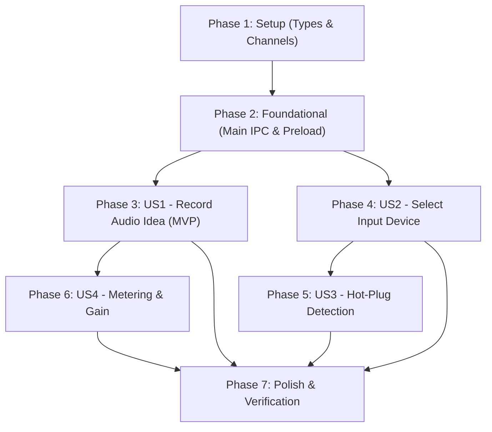

# Tasks: Audio Capture & Real-Time Recording

**Feature**: 004-audio-capture  
**Branch**: `004-audio-capture` | **Spec**: [`specs/004-audio-capture/spec.md`](file:///Users/andresdelgado/Documents/Coding/Vault/specs/004-audio-capture/spec.md) | **Plan**: [`specs/004-audio-capture/plan.md`](file:///Users/andresdelgado/Documents/Coding/Vault/specs/004-audio-capture/plan.md)

---

## Phase 1: Setup (Shared Infrastructure & Types)

**Purpose**: Establish shared TypeScript contracts, domain interfaces, and IPC channel constants across Main and Renderer.

- [X] T001 [P] Define `AudioInputDevice`, `RecordingState`, `RECORDING_STATES`, `VolumeMeterLevels`, and `SaveAudioFileInput` in `src/shared/types/audio-capture.ts`
- [X] T002 [P] Re-export `./audio-capture` in `src/shared/types/index.ts`
- [X] T003 [P] Add `AUDIO.SAVE_FILE` channel constant to `src/shared/ipc-channels.ts`
- [X] T004 Augment `VaultAPI` interface in `src/shared/types/vault-api.ts` with `saveAudioFile` method

---

## Phase 2: Foundational (Blocking Prerequisites)

**Purpose**: Implement and verify the Main process audio file persistence handler and preload bridge. MUST be complete before Renderer capture integration.

- [X] T005 Implement `registerAudioHandlers` for `IPC_CHANNELS.AUDIO.SAVE_FILE` in `src/main/ipc/audio-handlers.ts`
- [X] T006 Expose `registerAudioHandlers` within `registerAllHandlers` in `src/main/ipc/index.ts`
- [X] T007 Expose `saveAudioFile` bridge method on `vaultAPI` in `src/preload/index.ts`
- [X] T008 [P] Add unit tests for `audio:save-file` IPC handler and preload bridge in `src/main/ipc/__tests__/ipc-handlers.test.ts` and `src/preload/__tests__/preload.test.ts`

**Checkpoint**: Foundation ready — `window.vaultAPI.saveAudioFile` is callable and verified with tests.

---

## Phase 3: User Story 1 - Record an Audio Idea (Priority: P1) 🎯 MVP

**Goal**: A musician records a voice memo or musical idea using the active input device, assembles recorded chunks into a Blob, converts to a standard WAV `ArrayBuffer`, and persists it to disk via `window.vaultAPI.saveAudioFile(...)`.

**Independent Test**: Start recording with `AudioRecorder`, capture simulated or real audio chunks, stop recording, and verify a valid 16-bit PCM WAV `ArrayBuffer` is produced and saved to `<audioVault>/recordings/{uuid}.wav`.

### Tests for User Story 1

- [X] T009 [P] [US1] Create unit tests for WAV encoding verifying 44-byte RIFF/WAVE header and sample formatting in `src/renderer/audio/__tests__/wav-encoder.test.ts`
- [X] T010 [P] [US1] Create unit tests for `AudioRecorder` lifecycle and chunk assembly in `src/renderer/audio/__tests__/audio-recorder.test.ts`

### Implementation for User Story 1

- [X] T011 [P] [US1] Implement 16-bit linear PCM WAV encoder in `src/renderer/audio/wav-encoder.ts`
- [X] T012 [US1] Implement core `AudioRecorder` class coordinating `AudioContext`, `MediaStream`, `MediaRecorder`, chunk assembly, and stop/save workflow in `src/renderer/audio/audio-recorder.ts`

**Checkpoint**: User Story 1 complete — can record audio, encode to WAV, and persist via IPC.

---

## Phase 4: User Story 2 - Select an Input Device (Priority: P2)

**Goal**: A musician enumerates all connected audio input hardware, selects an active recording source, and has their device preference remembered across sessions.

**Independent Test**: Connect multiple input sources, invoke `getAudioInputDevices()`, verify all devices are listed with human-readable labels and default indicator, select a device, and verify subsequent recordings open `getUserMedia` with the selected `deviceId`.

### Tests for User Story 2

- [X] T013 [P] [US2] Create unit tests for device enumeration, labeling, and default resolution in `src/renderer/audio/__tests__/device-manager.test.ts`

### Implementation for User Story 2

- [X] T014 [US2] Implement `getAudioInputDevices` and persistent device selection in `src/renderer/audio/device-manager.ts`
- [X] T015 [US2] Integrate device selection constraints (`deviceId: { exact: id }`) into `AudioRecorder.startRecording` in `src/renderer/audio/audio-recorder.ts`

**Checkpoint**: User Story 2 complete — device enumeration and selection working independently.

---

## Phase 5: User Story 3 - Hot-Plug Device Change Detection (Priority: P3)

**Goal**: Automatically detect when audio interfaces or microphones are plugged in or disconnected, update the device list within 3 seconds, gracefully fall back to the system default, and salvage partial audio if disconnected mid-recording.

**Independent Test**: Simulate adding/removing devices via `devicechange` event listener; verify device list refreshes, fallback is selected, and active recording disconnect triggers graceful stop with partial audio preserved.

### Tests for User Story 3

- [X] T016 [P] [US3] Create unit tests for `devicechange` subscription, fallback switching, and mid-recording disconnect in `src/renderer/audio/__tests__/hot-plug.test.ts`

### Implementation for User Story 3

- [X] T017 [US3] Implement `subscribeToDeviceChanges` with event listener cleanup and fallback logic in `src/renderer/audio/device-manager.ts`
- [X] T018 [US3] Implement track `ended` listener on input `MediaStream` in `src/renderer/audio/audio-recorder.ts` to gracefully stop capture and preserve partial audio on disconnect

**Checkpoint**: User Story 3 complete — dynamic hardware changes handled safely without application crash or data loss.

---

## Phase 6: User Story 4 - Volume Level Metering & Input Gain Control (Priority: P4)

**Goal**: Real-time dual volume level metering (pre-gain raw input and post-gain recorded level) with clipping detection, plus adjustable input recording gain slider (0.0 to 2.0, default 1.0).

**Independent Test**: Pass known audio sample buffers through `calculateAudioLevels`, verify RMS and Peak values match expected formulas, verify clipping is flagged when peak >= 0.99, and verify `GainNode.gain.value` scales post-gain audio.

### Tests for User Story 4

- [X] T019 [P] [US4] Create unit tests for RMS, Peak, and clipping detection calculations in `src/renderer/audio/__tests__/meter-service.test.ts`

### Implementation for User Story 4

- [X] T020 [P] [US4] Implement `calculateAudioLevels` in `src/renderer/audio/meter-service.ts`
- [X] T021 [US4] Integrate dual `AnalyserNode` instances (pre-gain and post-gain) and `GainNode` into `AudioRecorder` in `src/renderer/audio/audio-recorder.ts`
- [X] T022 [US4] Implement `setInputGain(gain)` and `getMeterLevels()` methods in `src/renderer/audio/audio-recorder.ts`

**Checkpoint**: User Story 4 complete — dual VU metering and gain adjustment fully functional.

---

## Phase 7: Polish & Cross-Cutting Concerns

**Purpose**: Verification, security audits, and regression tests across the entire codebase.

- [X] T023 [P] Verify strict TypeScript type compliance with zero errors via `npx tsc --noEmit` and `npx tsc -p tsconfig.main.json --noEmit`
- [X] T024 [P] Audit Renderer codebase ensuring zero direct Node.js `fs` or `path` imports in `src/renderer/`
- [X] T025 Run full automated test suite (`npm test`) and execute all validation scenarios in `specs/004-audio-capture/quickstart.md`
- [X] T026 Update `docs/session_log.md` with implementation summary, test metrics, and architectural updates

---

## Dependencies & Execution Order

### Phase Dependencies



### User Story Dependencies
- **US1 (P1 - Record Idea)**: Depends on Phase 1 and Phase 2. Core MVP.
- **US2 (P2 - Select Device)**: Depends on Phase 1 and Phase 2. Can be developed in parallel with US1.
- **US3 (P3 - Hot-Plug)**: Depends on US2 (`device-manager.ts`).
- **US4 (P4 - Metering & Gain)**: Depends on US1 (`audio-recorder.ts`).
- **Phase 7 (Polish)**: Depends on all user stories being completed.

---

## Parallel Opportunities

```bash
# Parallel Phase 1 (Types & Channels):
T001: src/shared/types/audio-capture.ts
T002: src/shared/types/index.ts
T003: src/shared/ipc-channels.ts

# Parallel Tests for User Stories:
T009: src/renderer/audio/__tests__/wav-encoder.test.ts
T010: src/renderer/audio/__tests__/audio-recorder.test.ts
T013: src/renderer/audio/__tests__/device-manager.test.ts
T016: src/renderer/audio/__tests__/hot-plug.test.ts
T019: src/renderer/audio/__tests__/meter-service.test.ts
```

---

## Implementation Strategy

### MVP First (Phases 1, 2, and 3)
1. Complete **Phase 1: Setup** (shared types, `saveAudioFile` channel).
2. Complete **Phase 2: Foundational** (Main IPC handler and preload bridge).
3. Complete **Phase 3: User Story 1** (WAV encoder, `AudioRecorder` basic capture and stop).
4. **VALIDATE MVP**: Verify audio can be recorded and saved directly to `<userData>/audio_vault/recordings/`.

### Incremental Feature Additions
5. Add **Phase 4: User Story 2** (hardware enumeration and switching).
6. Add **Phase 5: User Story 3** (hot-plugging and mid-recording disconnect defense).
7. Add **Phase 6: User Story 4** (dual VU metering and recording input gain).
8. Run **Phase 7: Polish** (typechecks, security audit, full regression).
