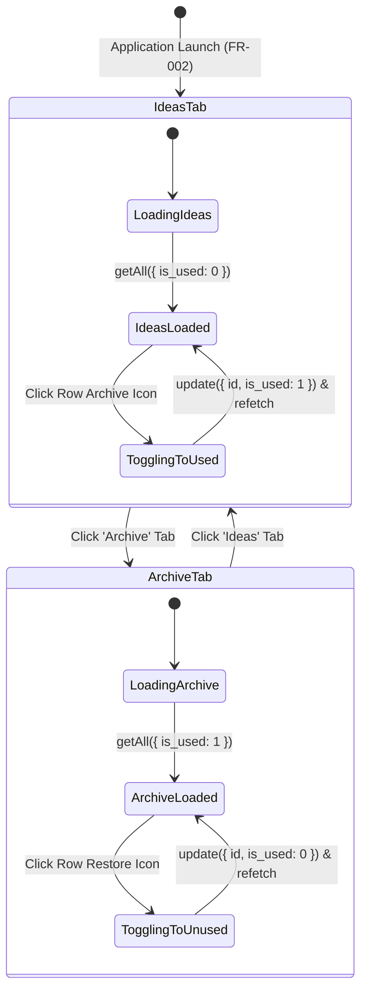

# Phase 1 Data Model: Ideas Table UI

**Feature**: `005-ideas-table-ui`  
**Date**: 2026-09-04

---

## 1. Core Domain Types (Consumed in Renderer)

These types are imported directly from `@shared/types`:

### `AudioNote`

The core entity representing a musical idea stored in SQLite:

```typescript
export interface AudioNote {
  id: number;
  title: string;
  file_path: string;
  duration_seconds: number;
  bpm: number | null;
  musical_key: string | null;
  authors: string | null;
  song_section: string | null;
  notes: string | null;
  is_used: 0 | 1;
  created_at: string; // ISO 8601
  updated_at: string; // ISO 8601
}
```

### `Instrument`

Tag entity representing instruments associated with notes:

```typescript
export interface Instrument {
  id: number;
  name: string;
}
```

---

## 2. UI-Specific State & View Models

### `NoteWithInstruments`

The enriched view model displayed in each row of the ideas table:

```typescript
export interface NoteWithInstruments extends AudioNote {
  instruments: Instrument[];
}
```

### `Theme`

User preference stored in `localStorage` under key `'vault_theme'`:

```typescript
export type Theme = "light" | "dark";

export interface ThemeContextValue {
  theme: Theme;
  toggleTheme: () => void;
}
```

### `ActiveTab`

Controls which subset of notes is displayed:

```typescript
export type TabFilter = 0 | 1; // 0 = Ideas (is_used: 0), 1 = Archive (is_used: 1)
```

---

## 3. State Transitions & Lifecycle



---

## 4. UI Column Model

| Column Index | Attribute          | Type / Format    | Display Logic                                                    |
| ------------ | ------------------ | ---------------- | ---------------------------------------------------------------- |
| 1            | `title`            | `string`         | Medium weight, truncated with ellipsis if >180px                 |
| 2            | `duration_seconds` | `number`         | Formatted `m:ss` (e.g. `1:23`, `0:05`), tabular figures          |
| 3            | `bpm`              | `number \| null` | Tabular figures or empty string if null                          |
| 4            | `musical_key`      | `string \| null` | Key name (e.g. `Am`, `C#`) or empty string if null               |
| 5            | `authors`          | `string \| null` | Truncated with ellipsis if >120px, or empty string               |
| 6            | `song_section`     | `string \| null` | Section name (e.g. `Verse`, `Chorus`) or empty string            |
| 7            | `instruments`      | `Instrument[]`   | Horizontal tag pills (`rounded-full px-2 py-0.5 text-xs`)        |
| 8            | `created_at`       | `string` (ISO)   | Formatted localized date (e.g. `Sep 3, 2026`), whitespace nowrap |
| 9            | `notes`            | `string \| null` | Truncated with ellipsis if >140px, or empty string               |
| 10           | Action             | Action button    | Archive icon (`is_used: 0`) or Restore icon (`is_used: 1`)       |
