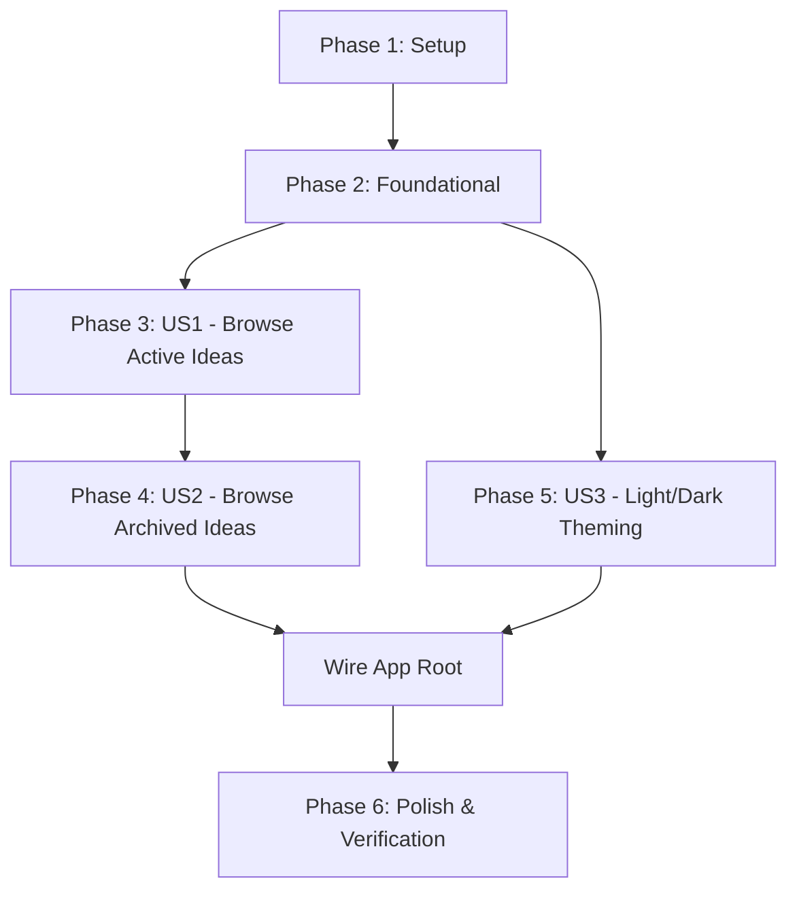

# Tasks: Ideas Table UI

**Feature**: `005-ideas-table-ui`  
**Branch**: `005-ideas-table-ui` | **Spec**: [`specs/005-ideas-table-ui/spec.md`](./spec.md) | **Plan**: [`specs/005-ideas-table-ui/plan.md`](./plan.md)

---

## Phase 1: Setup (Shared Infrastructure & Build Tooling)

**Purpose**: Initialize frontend dependencies, Vite bundler, Tailwind CSS v3 with Apple design tokens, and TypeScript configurations.

- [X] T001 Install React 19, Tailwind CSS v3, PostCSS, Vite, jsdom, and testing libraries in `package.json` (dropping unnecessary autoprefixer)
- [X] T002 [P] Create `vite.config.ts` configuring root `src/renderer`, path aliases (`@shared`), and output to `dist/renderer`
- [X] T003 [P] Create `tailwind.config.cjs` with `darkMode: 'class'`, Apple design tokens, and minimal `postcss.config.cjs` (without autoprefixer)
- [X] T004 [P] Create `tsconfig.renderer.json` with React JSX and DOM library support
- [X] T005 [P] Update `vitest.config.ts` with jsdom environment matching and create `src/renderer/test-setup.ts`

---

## Phase 2: Foundational (Blocking Prerequisites)

**Purpose**: Core application shell, HTML entry point, design tokens, and main process window loader that MUST be complete before user stories can render.

**⚠️ CRITICAL**: No user story UI can load until this foundation is in place.

- [X] T006 Create `src/renderer/index.html` with security Content Security Policy and `#root` container
- [X] T007 [P] Create `src/renderer/styles/index.css` defining Apple design system CSS custom properties and Tailwind directives
- [X] T008 [P] Implement duration and date formatting utilities in `src/renderer/lib/format.ts`
- [X] T009 [P] Add unit tests for formatting utilities in `src/renderer/lib/__tests__/format.test.ts`
- [X] T010 Implement `src/renderer/components/RecordingPanel.tsx` placeholder for the reserved bottom recording dock (FR-015)
- [X] T011 Update `createWindow()` in `src/main/index.ts` to load Vite dev URL (`http://localhost:5173`) or built HTML (`dist/renderer/index.html`)

**Checkpoint**: Foundation ready — Electron main process can load the renderer entry point, design tokens are loaded, and base formatters are verified with tests.

---

## Phase 3: User Story 1 - Browse Active Ideas (Priority: P1) 🎯 MVP

**Goal**: Musician opens Vault and immediately sees active unused ideas (`is_used = 0`) in a table with all metadata labels (Title, Duration, BPM, Key, Authors, Section, Instruments, Created Date, Notes), empty states, and an action button to toggle ideas to archive.

**Independent Test**: Populate database with ideas where `is_used = 0`. Open app and verify table lists all ideas with formatted duration, date, instrument tags, and no "null" text. Clicking archive toggle removes the row from the view.

### Tests for User Story 1 ⚠️

> **NOTE: Write these tests FIRST, ensure they fail before implementation.**

- [X] T012 [P] [US1] Create unit tests for `<EmptyState />` in `src/renderer/components/__tests__/EmptyState.test.tsx`

### Implementation for User Story 1

- [X] T013 [P] [US1] Implement `<EmptyState />` component in `src/renderer/components/EmptyState.tsx`
- [X] T014 [US1] Implement `src/renderer/hooks/useNotes.ts` to fetch notes by `is_used` and enrich with instruments in parallel via `window.vaultAPI`
- [X] T015 [US1] Implement `<TableRow />` in `src/renderer/components/TableRow.tsx` rendering all metadata columns, instrument pills, notes truncation, and archive toggle action
- [X] T016 [US1] Implement `<IdeasTable />` in `src/renderer/components/IdeasTable.tsx` coordinating loading, error, empty, and table header/row display with refetch on toggle

**Checkpoint**: User Story 1 complete — can browse active musical ideas, see all labels, and toggle them to archive. MVP is functional!

---

## Phase 4: User Story 2 - Browse Archived Ideas (Priority: P2)

**Goal**: Musician switches to the "Archive" tab to browse used ideas (`is_used = 1`), with a restore action button that moves ideas back to the active ideas tab.

**Independent Test**: Switch to the Archive tab, verify only `is_used = 1` ideas appear. Clicking restore moves the idea back to the Ideas tab.

### Tests for User Story 2 ⚠️

- [X] T017 [P] [US2] Create unit tests for `<TabBar />` in `src/renderer/components/__tests__/TabBar.test.tsx`

### Implementation for User Story 2

- [X] T018 [US2] Implement `<TabBar />` segmented control component in `src/renderer/components/TabBar.tsx`
- [X] T019 [US2] Implement `<AppLayout />` in `src/renderer/components/AppLayout.tsx` binding `activeTab` state (0 vs 1) between `TabBar` and `IdeasTable`

**Checkpoint**: User Stories 1 AND 2 complete — seamless tabbed workflow between active and archived musical ideas.

---

## Phase 5: User Story 3 - Toggle Light and Dark Theme (Priority: P3)

**Goal**: Musician toggles light/dark visual themes in the top-right header with instant Apple HIG visual transition and persistent user preference across restarts.

**Independent Test**: Click Sun/Moon icon in header, verify entire UI switches theme tokens. Restart app and verify stored theme is preserved.

### Tests for User Story 3 ⚠️

- [X] T020 [P] [US3] Create unit tests for `ThemeContext` in `src/renderer/context/__tests__/ThemeContext.test.tsx`

### Implementation for User Story 3

- [X] T021 [US3] Implement `src/renderer/context/ThemeContext.tsx` with light/dark state, localStorage persistence, and DOM class toggle
- [X] T022 [P] [US3] Implement `<ThemeToggle />` button with Sun/Moon SVG icons in `src/renderer/components/ThemeToggle.tsx`
- [X] T023 [US3] Implement `<Header />` in `src/renderer/components/Header.tsx` hosting title and `<ThemeToggle />`
- [X] T024 [US3] Wire `<ThemeProvider>` and layout into `<App />` in `src/renderer/App.tsx` and bootstrap root in `src/renderer/index.tsx`

**Checkpoint**: All three user stories functional — complete ideas catalog with dual-tab support, Apple theming, and full design system integration.

---

## Phase 6: Polish & Cross-Cutting Concerns

**Purpose**: Quality assurance, type safety verification, build validations, and documentation updates.

- [X] T025 [P] Run full automated test suite (`npm test`) across all 12+ suites and verify 100% pass rate
- [X] T026 [P] Run TypeScript strict typecheck across root, main, and renderer tsconfigs (`npx tsc --noEmit`)
- [X] T027 Verify clean production compilation (`npm run build:main` and `npm run build:renderer`)
- [X] T028 Validate all manual scenarios from `specs/005-ideas-table-ui/quickstart.md`
- [X] T029 Update `docs/session_log.md` with implementation summary and metrics

---

## Dependencies & Execution Order

### Phase Dependencies

- **Setup (Phase 1)**: No dependencies — can start immediately.
- **Foundational (Phase 2)**: Depends on Phase 1 completion — BLOCKS all user stories.
- **User Story 1 (Phase 3 - MVP)**: Depends on Foundational phase completion.
- **User Story 2 (Phase 4)**: Depends on US1 table infrastructure; adds tab control and layout binding.
- **User Story 3 (Phase 5)**: Depends on foundational design tokens; integrates theme context across the shell.
- **Polish (Phase 6)**: Depends on all user stories being complete.

### User Story Dependencies

### Parallel Opportunities

- **Phase 1**: `T002` (Vite config), `T003` (Tailwind config), `T004` (tsconfig), and `T005` (Vitest config) can run in parallel after `T001`.
- **Phase 2**: `T007` (CSS custom properties), `T008` (format utilities), and `T009` (format tests) can run in parallel.
- **User Story 1**: `T012` (empty state test) and `T013` (empty state component) can run in parallel with `T014` (hook).
- **User Story 2 & 3**: `T017` (TabBar tests) and `T020` (ThemeContext tests) can run in parallel.
- **Phase 6**: `T025` (tests) and `T026` (type checks) can run in parallel.

---

## Implementation Strategy

### MVP First (User Story 1 Only)

1. Complete Phase 1: Setup (build dependencies and configs).
2. Complete Phase 2: Foundational (HTML, styles, formatters, main window URL).
3. Complete Phase 3: User Story 1 (table, hook, rows, and active idea display).
4. **Validate MVP**: Musician can open the app and view their active musical ideas with all labels.

### Incremental Delivery

1. Add User Story 2: Segmented tab bar and archive view.
2. Add User Story 3: Light and dark theme toggle with persistence.
3. Polish and verify all tests and builds.
