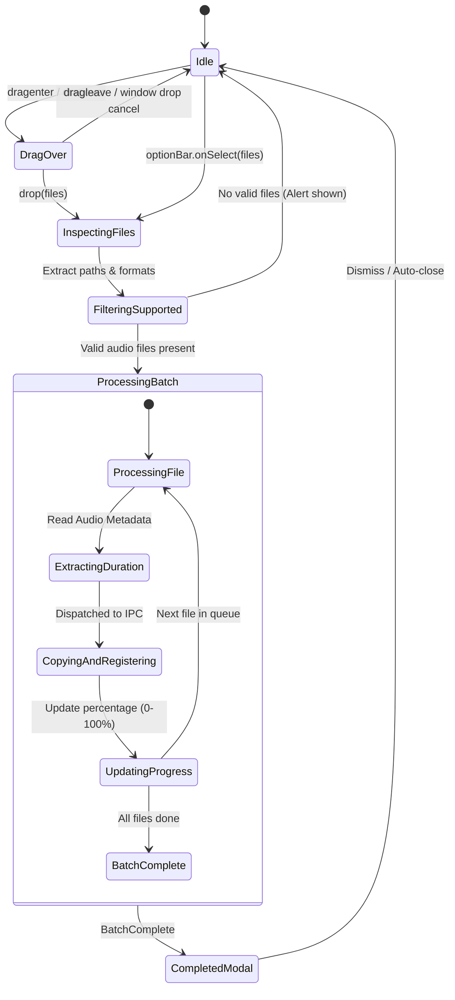

# Data Model: Audio Ideas Import

**Feature**: `006-import-audio-ideas`  
**Date**: 2026-09-08  
**Status**: Completed  

---

## 1. Entities & In-Memory Structures

### 1.1 `ImportFileItem` (Renderer Memory)
Represents an individual file selected or dropped by the user during an active import session.

```typescript
export type ImportFileStatus = 'pending' | 'processing' | 'completed' | 'error';

export interface ImportFileItem {
  id: string;                      // Unique client-side task ID (e.g. UUID)
  name: string;                    // Base file name (e.g., "Acoustic Sketch 1.wav")
  title: string;                   // Cleaned note title without extension
  sourcePath: string;              // Absolute path on host disk (from webUtils.getPathForFile)
  format: AudioFormat;             // 'wav' | 'mp3' | 'm4a' | 'ogg' | 'flac'
  sizeBytes: number;               // File byte size
  durationSeconds: number;         // Extracted audio duration
  status: ImportFileStatus;        // Lifecycle state
  error?: string;                  // Friendly error message if failed
}
```

---

### 1.2 `ImportBatchState` (Renderer UI State)
Coordinates the active import operation and drives the `<CircularProgressModal />`.

```typescript
export interface ImportBatchState {
  isActive: boolean;               // True while import is running
  totalFiles: number;              // Total number of files in current batch
  currentIndex: number;            // 1-based index of current file being processed
  currentFileName: string;         // Name of the currently processing file
  overallPercentage: number;       // 0 to 100 for the circular progress indicator
  isComplete: boolean;             // True when all files have finished
  errors: Array<{ filename: string; error: string }>; // Accumulated failure list
}
```

---

### 1.3 `ImportAudioFileInput` (Shared IPC Contract)
Payload dispatched from Renderer to Main over IPC to copy a file and create an `AudioNote` atomically.

```typescript
export interface ImportAudioFileInput {
  source_path: string;             // Absolute host path to original audio file
  title?: string;                  // User-specified or derived note title
  duration_seconds: number;        // Extracted duration in seconds
  bpm?: number | null;             // Optional musical metadata (null on import)
  musical_key?: string | null;     // Optional key (null on import)
  authors?: string | null;         // Optional authors (null on import)
  song_section?: string | null;    // Optional song section (null on import)
  notes?: string | null;           // Optional user notes (null on import)
  instrument_names?: string[];     // Optional instrument tags (empty on import)
}
```

---

### 1.4 `AudioNote` (Persistent Database Entity)
No database schema migrations are required; existing schema accommodates all imported notes directly.

| Field | SQLite Type | Nullable | Constraints / Defaults | Description |
|---|---|---|---|---|
| `id` | `INTEGER` | No | Primary Key Autoincrement | Unique idea ID |
| `title` | `TEXT` | No | Default: sanitized filename | Idea title displayed in table |
| `file_path` | `TEXT` | No | `recordings/{uuid}.{ext}` | Relative vault path to audio file |
| `duration_seconds`| `REAL` | No | $\ge 0$ | Duration in seconds |
| `bpm` | `REAL` | Yes | Nullable, CHECK > 0 | Default: `null` |
| `musical_key` | `TEXT` | Yes | Nullable | Default: `null` |
| `authors` | `TEXT` | Yes | Nullable | Default: `null` |
| `song_section` | `TEXT` | Yes | Nullable | Default: `null` |
| `notes` | `TEXT` | Yes | Nullable | Default: `null` |
| `is_used` | `INTEGER` | No | Default `0` (Active) | 0 for Active, 1 for Archived |
| `created_at` | `TEXT` | No | ISO 8601 string | Creation timestamp |
| `updated_at` | `TEXT` | No | ISO 8601 string | Modification timestamp |

---

## 2. State Transitions & Lifecycle

### Import Job Lifecycle State Diagram



---

## 3. Validation Rules

1. **Format Whitelist**:
   - Only files ending with `.wav`, `.mp3`, `.m4a`, `.ogg`, or `.flac` (case-insensitive) are accepted for processing.
   - Files with unsupported extensions are filtered out and listed in an import notice.
2. **Magic-Byte Header Check**:
   - `AudioStorageService` validates file header bytes against claimed extension before copying.
   - Header mismatches fail that individual file with `HEADER_MISMATCH` while letting the rest of the batch continue.
3. **Source Preservation**:
   - Source files are opened strictly in read-only mode (`fs.openSync(..., 'r')` and `fs.copyFileSync(...)`).
   - Under no circumstances is `fs.unlink` or `fs.rename` called on the source path.
4. **Title Sanitization**:
   - Title is stripped of extension and leading/trailing whitespace.
   - If empty after sanitization, defaults to `idea-N` via atomic sequence generator.
5. **Initial State**:
   - All newly imported notes are assigned `is_used = 0` so they appear immediately in the "Ideas" (Active) tab.
