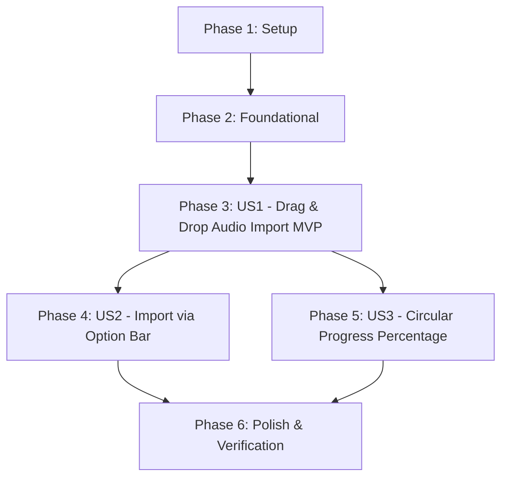

# Tasks: Audio Ideas Import

**Feature**: `006-import-audio-ideas`  
**Branch**: `006-import-audio-ideas` | **Spec**: [`specs/006-import-audio-ideas/spec.md`](./spec.md) | **Plan**: [`specs/006-import-audio-ideas/plan.md`](./plan.md)

---

## Phase 1: Setup (Shared Types & IPC Channels)

**Purpose**: Define the shared data contracts, IPC channels, and preload bridge signatures required for audio file import operations.

- [X] T001 Register `AUDIO.IMPORT_FILE` and `AUDIO.OPEN_FILE_DIALOG` in `src/shared/ipc-channels.ts`
- [X] T002 [P] Define `ImportAudioFileInput` interface in `src/shared/types/audio.ts`
- [X] T003 [P] Augment `VaultAPI` interface in `src/shared/types/vault-api.ts` with `getPathForFile`, `importAudioFile`, and `openFileDialog`, and re-export in `src/shared/types/index.ts`

---

## Phase 2: Foundational (Main IPC Handlers & Preload Bridge)

**Purpose**: Implement the Main process IPC handlers, file-to-note persistence, Preload bridge methods, and metadata duration extraction utilities that MUST be in place before user story interfaces can function.

**⚠️ CRITICAL**: No user story UI can complete imports until this foundation is ready.

### Tests for Foundation ⚠️

> **NOTE: Write these tests FIRST, ensure they fail before implementation.**

- [X] T004 [P] Create IPC handler integration tests in `src/main/ipc/__tests__/import-handlers.test.ts` testing `audio:import-file` disk copy, header validation, database insertion, and `audio:open-file-dialog`
- [X] T005 [P] Create unit tests for duration extraction utility in `src/renderer/lib/__tests__/audio-metadata.test.ts`

### Implementation for Foundation

- [X] T006 Implement `IPC_CHANNELS.AUDIO.IMPORT_FILE` and `IPC_CHANNELS.AUDIO.OPEN_FILE_DIALOG` handlers in `src/main/ipc/audio-handlers.ts`
- [X] T007 Update `registerAudioHandlers` call site in `src/main/ipc/index.ts` to pass SQLite database reference and wire handlers into `registerAllHandlers`
- [X] T008 Expose `getPathForFile`, `importAudioFile`, and `openFileDialog` in `src/preload/index.ts` using `webUtils.getPathForFile(file)`
- [X] T009 Update `src/preload/__tests__/preload.test.ts` asserting the new import and dialog bridge methods invoke correct IPC channels
- [X] T010 [P] Implement `extractAudioDuration(file: File): Promise<number>` in `src/renderer/lib/audio-metadata.ts` using HTML5 `Audio` metadata loading

**Checkpoint**: Foundation ready — Main process can import files on disk and register `AudioNote` records; Renderer has typed bridge and duration extraction.

---

## Phase 3: User Story 1 - Drag and Drop Audio Import (Priority: P1) 🎯 MVP

**Goal**: A musician drags one or more audio files onto the Vault window. The window displays a drop overlay, copies files to internal storage preserving originals, extracts durations, creates database ideas with filename as title, and refreshes the ideas table.

**Independent Test**: Drag a supported audio file (`.wav` or `.mp3`) from disk onto the Vault window. Verify the file is copied into `audio_vault/recordings/`, a new row appears in the Active Ideas table with the correct title and duration, and the original file remains unchanged on disk.

### Tests for User Story 1 ⚠️

- [X] T011 [P] [US1] Create unit tests for `<DragDropOverlay />` in `src/renderer/components/__tests__/DragDropOverlay.test.tsx`
- [X] T012 [P] [US1] Create unit tests for `useAudioImport` hook in `src/renderer/hooks/__tests__/useAudioImport.test.ts`

### Implementation for User Story 1

- [X] T013 [P] [US1] Implement `<DragDropOverlay />` component in `src/renderer/components/DragDropOverlay.tsx` with animated dashed border and backdrop blur
- [X] T014 [US1] Implement `useAudioImport` hook in `src/renderer/hooks/useAudioImport.ts` managing window drag/drop event listeners, file format filtering, duration extraction, IPC import dispatch, and table refetch trigger
- [X] T015 [US1] Integrate `useAudioImport` and `<DragDropOverlay />` into `<AppLayout />` in `src/renderer/components/AppLayout.tsx`

**Checkpoint**: User Story 1 complete — Drag and Drop import is fully functional and delivers immediate value as a standalone MVP!

---

## Phase 4: User Story 2 - Import via Option Bar (Priority: P2)

**Goal**: A musician clicks the "Import" button in the header/option bar, chooses audio files via the native file picker dialog, and imports them through the unified ingestion pipeline.

**Independent Test**: Click "Import" in the header bar, select one or more audio files in the file picker, and confirm. Verify the selected files are imported, cataloged in the ideas table, and original source files remain intact.

### Tests for User Story 2 ⚠️

- [X] T016 [P] [US2] Create unit tests for header import button in `src/renderer/components/__tests__/Header.test.tsx`

### Implementation for User Story 2

- [X] T017 [US2] Update `<Header />` in `src/renderer/components/Header.tsx` to include an "Import" button with an upload icon and hidden file input / dialog trigger
- [X] T018 [US2] Connect `<Header onImport={...} />` to the `importFiles` action in `src/renderer/components/AppLayout.tsx`

**Checkpoint**: User Stories 1 AND 2 complete — users can import audio via both drag-and-drop and conventional menu controls.

---

## Phase 5: User Story 3 - Visual Progress with Loading Percentage Circle (Priority: P3)

**Goal**: During file import, a circular progress indicator displays real-time loading percentage (0% to 100%), batch status, and cleanly dismisses upon completion.

**Independent Test**: Import a batch of audio files. Verify a circular loading indicator appears with numeric percentage advancing from 0% to 100%, displays current file details, and dismisses when complete.

### Tests for User Story 3 ⚠️

- [X] T019 [P] [US3] Create unit tests for `<CircularProgressModal />` in `src/renderer/components/__tests__/CircularProgressModal.test.tsx`

### Implementation for User Story 3

- [X] T020 [P] [US3] Implement `<CircularProgressModal />` in `src/renderer/components/CircularProgressModal.tsx` with SVG circle progress ring, centered percentage typography, and batch status
- [X] T021 [US3] Update `useAudioImport` in `src/renderer/hooks/useAudioImport.ts` to compute cumulative percentage progress across batch files and track errors
- [X] T022 [US3] Wire `<CircularProgressModal />` into `<AppLayout />` in `src/renderer/components/AppLayout.tsx`

**Checkpoint**: All three user stories functional — complete import experience with multi-modal ingestion, visual drag target, and circular progress feedback.

---

## Phase 6: Polish & Cross-Cutting Concerns

**Purpose**: Quality assurance, strict typing validation, production build verification, and documentation updates.

- [X] T023 [P] Run TypeScript strict typecheck across root, main, and renderer configurations (`npx tsc --noEmit && npx tsc -p tsconfig.main.json --noEmit && npx tsc -p tsconfig.renderer.json --noEmit`)
- [X] T024 [P] Run full automated test suite (`npm test`) and verify 100% pass rate
- [X] T025 Verify clean production build (`npm run build`)
- [X] T026 Validate all manual scenarios in `specs/006-import-audio-ideas/quickstart.md`
- [X] T027 Update `docs/session_log.md` with implementation summary, architectural decisions, and verification metrics

---

## Dependencies & Execution Order

### Phase Dependencies

- **Setup (Phase 1)**: No dependencies — can start immediately.
- **Foundational (Phase 2)**: Depends on Phase 1 completion — BLOCKS all user stories.
- **User Story 1 (Phase 3 - MVP)**: Depends on Foundational phase completion.
- **User Story 2 (Phase 4)**: Depends on Foundational phase; reuses US1 import pipeline.
- **User Story 3 (Phase 5)**: Depends on US1 import pipeline; adds progress tracking UI.
- **Polish (Phase 6)**: Depends on all user stories being complete.

### User Story Dependencies

### Parallel Opportunities

- **Phase 1**: `T002` (audio types) and `T003` (vault API) can run in parallel after `T001`.
- **Phase 2**: `T004` (IPC tests) and `T005` (duration tests) can run in parallel.
- **User Story 1**: `T011` (overlay tests) and `T012` (hook tests) can run in parallel.
- **User Story 2**: `T016` (Header tests) can run in parallel with US1 work.
- **User Story 3**: `T019` (progress modal tests) and `T020` (progress modal component) can run in parallel.
- **Phase 6**: `T023` (typecheck) and `T024` (tests) can run in parallel.

---

## Implementation Strategy

### MVP First (User Story 1 Only)

1. Complete Phase 1: Setup (IPC channels and contracts).
2. Complete Phase 2: Foundational (Main process import handler, preload bridge, duration extraction).
3. Complete Phase 3: User Story 1 (Drag & drop overlay, hook, and table refresh).
4. **Validate MVP**: Musician can drag an audio file into Vault and immediately see it cataloged in their Ideas table with original file preserved.

### Incremental Delivery

1. Add User Story 2: Option bar "Import" button with native file dialog.
2. Add User Story 3: Circular loading progress indicator showing numeric percentage.
3. Complete Phase 6: Polish, regression testing, and documentation.
