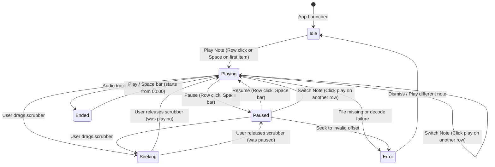

# Data Model: Play Audio Ideas

**Feature**: Play Audio Ideas
**Branch**: `008-play-audio-ideas`
**Date**: 2026-09-08

## Entities

### 1. PlaybackSession (In-Memory Runtime State)

Represents the transient state of the audio player in the Renderer process. This entity is stored in React context and is not persisted to SQLite.

| Field | Type | Required | Description |
|---|---|---|---|
| `currentNote` | `NoteWithInstruments \| null` | Yes | The currently loaded audio idea, or null if no track has been loaded. |
| `playbackStatus` | `'idle' \| 'playing' \| 'paused' \| 'ended' \| 'error'` | Yes | The current playback lifecycle status. |
| `currentTime` | `number` | Yes | Current playback timestamp in seconds (floored or floating point). |
| `duration` | `number` | Yes | Total duration in seconds of the currently loaded audio idea. |
| `isSeeking` | `boolean` | Yes | True while the user is actively dragging the scrubber slider. |
| `seekTime` | `number \| null` | No | Intermediate timestamp while dragging the scrubber, before commit. |
| `errorMessage` | `string \| null` | No | Description of playback error (e.g., file not found, decode failure). |

### 2. AudioNote (Database Entity - Referenced)

Persisted in SQLite and defined in `@shared/types/audio-note.ts`. Referenced by the playback engine.

| Field | Type | Constraints | Description |
|---|---|---|---|
| `id` | `INTEGER` | Primary Key, Auto-increment | Unique identifier of the note. |
| `title` | `TEXT` | NOT NULL | Title of the musical idea. |
| `file_path` | `TEXT` | NOT NULL | Relative path within `audio_vault/` (e.g. `recordings/{uuid}.wav`). |
| `duration_seconds` | `REAL` | NOT NULL, >= 0 | Pre-calculated audio duration in seconds. |
| `is_used` | `INTEGER` | 0 or 1 | 0 = Available, 1 = Used/Archived. |

---

## Playback State Machine

### State Transitions & Rules

1. **Idle → Playing**:
   - Trigger: User clicks play on an idea row in `IdeasTable`, or presses Space bar when a valid idea can be activated.
   - Action: Set `currentNote = note`, instantiate or update `audio.src = 'vault-audio://stream/' + note.file_path`, call `audio.play()`, set `playbackStatus = 'playing'`.

2. **Playing → Paused**:
   - Trigger: User clicks pause on the active idea row or presses Space bar.
   - Action: Call `audio.pause()`, set `playbackStatus = 'paused'`.

3. **Paused → Playing**:
   - Trigger: User clicks play on the active idea row or presses Space bar.
   - Action: Call `audio.play()`, set `playbackStatus = 'playing'`.

4. **Switch Note (Playing/Paused → Playing)**:
   - Trigger: User clicks play on a *different* row than `currentNote.id`.
   - Action: Call `audio.pause()`, set `audio.currentTime = 0`, update `audio.src` to new note, call `audio.play()`, set `currentNote = newNote`, `playbackStatus = 'playing'`.

5. **Seeking (Scrubber Drag/Click)**:
   - Trigger: User interacts with the top-center time bar.
   - Action: If dragging, update `seekTime` for responsive UI without thrashing audio element. Upon release/change, set `audio.currentTime = newTime`, update `currentTime = newTime`.

6. **Track End (Playing → Ended)**:
   - Trigger: HTML5 `ended` event fires on audio element.
   - Action: Reset `audio.currentTime = 0`, set `playbackStatus = 'ended'` (or `'paused'`), `currentTime = 0`. Controls revert to play icon.

7. **Error**:
   - Trigger: HTML5 `error` event fires or protocol returns 404/500.
   - Action: Set `playbackStatus = 'error'`, record `errorMessage`, reset playback controls to idle.

---

## Validation & Business Rules

- **BR-1: Single Active Stream**: Exactly one `AudioNote` can be in the playing state at any instant.
- **BR-2: Path Traversal Containment**: The custom protocol handler MUST reject any request where the resolved path escapes `audio_vault/`.
- **BR-3: Input Focus Immunity**: Space bar shortcut MUST be ignored when active focus is inside any `<input>`, `<textarea>`, content-editable element, or when table inline editing is active (`activeCellId !== null`).
- **BR-4: Non-destructive Archival**: If an idea is archived or its row is toggled while playing, playback continues until explicitly paused or replaced, or resets cleanly if deleted.
