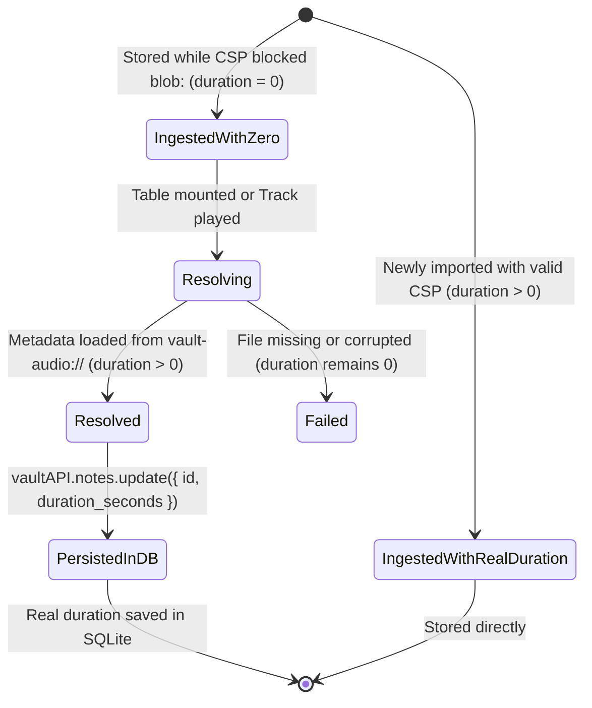

# Data Model: Fix Audio Playback CSP and Real Duration Display

**Feature**: Fix Audio Playback CSP and Real Duration Display
**Branch**: `009-fix-playback-duration`
**Date**: 2026-09-08

## Entities and Schema Updates

### 1. UpdateAudioNoteInput (Shared Contract)

Extended to permit updating `duration_seconds`.

| Field | Type | Required | Description |
|---|---|---|---|
| `id` | `number` | Yes | Target note identifier. |
| `duration_seconds` | `number` | No | Updated real duration in seconds (must be >= 0). |
| `title` | `string` | No | Optional updated title. |
| `bpm` | `number \| null` | No | Optional updated BPM. |
| `musical_key` | `string \| null` | No | Optional updated Key. |
| `authors` | `string \| null` | No | Optional updated Authors. |
| `song_section` | `string \| null` | No | Optional updated Section. |
| `notes` | `string \| null` | No | Optional updated Notes. |
| `is_used` | `0 \| 1` | No | Optional updated status. |
| `instrument_names` | `string[]` | No | Optional updated instruments. |

---

### 2. AudioNote Lifecycle & Duration State Transition

### State Transitions

1. **Missing Duration (`duration_seconds <= 0`)**:
   - Initial state for notes imported prior to CSP fix.
2. **Dynamic Resolution**:
   - Trigger: Note rendered in table or loaded into audio player.
   - Action: Temporary audio element loads container metadata from `vault-audio://stream/${note.file_path}`.
3. **Persisted Resolution**:
   - Once resolved (`duration > 0`), updates the in-memory note and commits to SQLite via `vaultAPI.notes.update({ id, duration_seconds })`.
