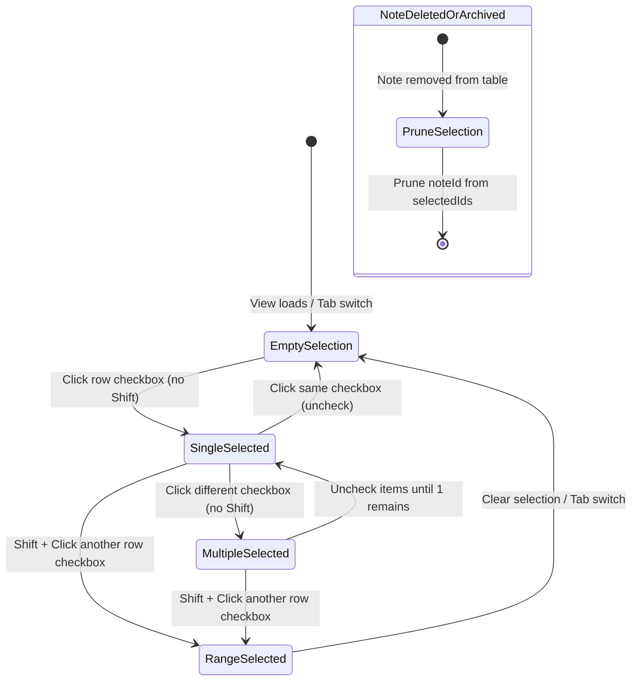

# Phase 1: Data Model & State Specifications

**Feature**: Row Selection via Checkboxes (Spec 010)  
**Date**: 2026-09-11

## Overview

Row selection is a client-side transient UI state model residing entirely in the Renderer process. It requires zero database schema migrations and zero IPC modifications, adhering to **Stack Simplicity** and **Process Separation**.

---

## State Entities

### 1. `RowSelectionState`

Represents the active selection across the currently viewed audio notes catalog.

| Field | Type | Description |
| :--- | :--- | :--- |
| `selectedIds` | `Set<number>` | Set of `note.id` numbers currently selected. |
| `lastAnchorIndex` | `number \| null` | 0-based visual index of the last checkbox clicked without Shift, used as range anchor. |

### 2. Derived State & Computations

- `selectedCount: number` $\rightarrow$ `selectedIds.size`.
- `isSelected: (noteId: number) => boolean` $\rightarrow$ `selectedIds.has(noteId)` ($O(1)$ check).
- `isAllSelected: boolean` $\rightarrow$ `notes.length > 0 && selectedIds.size === notes.length`.
- `isIndeterminate: boolean` $\rightarrow$ `selectedIds.size > 0 && selectedIds.size < notes.length`.

---

## State Transitions

### Transition Operations

1. **`toggleRow(noteId: number, visualIndex: number, isShiftKey: boolean)`**:
   - **Case A (`!isShiftKey`)**:
     - If `selectedIds.has(noteId)`: remove `noteId`.
     - Else: add `noteId`.
     - Set `lastAnchorIndex = visualIndex`.
   - **Case B (`isShiftKey`)**:
     - If `lastAnchorIndex === null`:
       - Add `noteId` to `selectedIds`.
       - Set `lastAnchorIndex = visualIndex`.
     - Else:
       - `min = Math.min(lastAnchorIndex, visualIndex)`
       - `max = Math.max(lastAnchorIndex, visualIndex)`
       - Add all IDs from `notes.slice(min, max + 1)` into `selectedIds`.
       - Keep `lastAnchorIndex` unchanged (or update, preserving contiguous range selection).

2. **`selectAll(allNoteIds: number[])`**:
   - Replaces `selectedIds` with `new Set(allNoteIds)`.

3. **`clearSelection()`**:
   - Sets `selectedIds = new Set()` and `lastAnchorIndex = null`.

4. **`pruneMissing(validNoteIds: number[])`**:
   - Removes any ID from `selectedIds` that is not present in `validNoteIds`.

---

## Validation & Invariant Rules

- **ID Uniqueness**: Each note has an integer `id > 0`.
- **Index Bounds**: `0 <= visualIndex < notes.length`.
- **Tab Isolation**: Switching between `is_used = 0` and `is_used = 1` resets `selectedIds` to empty, preventing invisible row operations.
