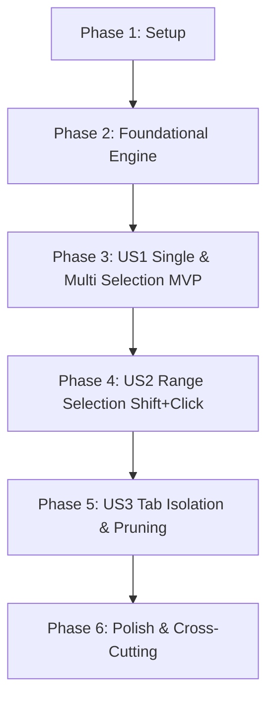

# Tasks: Row Selection via Checkboxes

**Branch**: `010-row-selection` | **Date**: 2026-09-11 | **Spec**: [specs/010-row-selection/spec.md](specs/010-row-selection/spec.md) | **Plan**: [specs/010-row-selection/plan.md](specs/010-row-selection/plan.md)

---

## Phase 1: Setup (Shared Infrastructure)

**Purpose**: Establish type contracts and test harnesses for row selection

- [X] T001 [P] Create selection type declarations in src/renderer/types/row-selection.ts
- [X] T002 [P] Create unit test scaffold for selection hook in src/renderer/hooks/__tests__/useRowSelection.test.ts

---

## Phase 2: Foundational (Selection State Engine)

**Purpose**: Implement core `useRowSelection` hook with Set-based state management, anchor tracking, and pruning

**⚠️ CRITICAL**: Hook engine must be verified before UI integration begins

- [X] T003 Implement core `useRowSelection` hook with single-row toggle and anchor management in src/renderer/hooks/useRowSelection.ts
- [X] T004 Add unit tests for single-row toggle, anchor tracking, and deselect in src/renderer/hooks/__tests__/useRowSelection.test.ts
- [X] T005 Implement `selectAll`, `clearSelection`, and auto-pruning for removed notes in src/renderer/hooks/useRowSelection.ts
- [X] T006 Add unit tests for `selectAll`, `clearSelection`, and note pruning in src/renderer/hooks/__tests__/useRowSelection.test.ts

**Checkpoint**: Selection hook engine fully operational with 100% unit test pass rate.

---

## Phase 3: User Story 1 - Single and Multi-Row Selection via Checkboxes (Priority: P1) 🎯 MVP

**Goal**: Display checkbox column at the far left of each row, allow clicking individual checkboxes to toggle selection state, and render distinct visual row highlights in light/dark themes.

**Independent Test**: Render ideas table with audio notes, click an individual row checkbox, verify checkbox checks and row highlights, click another row checkbox and verify both are selected, click first checkbox and verify it unselects.

### Tests for User Story 1

- [X] T007 [P] [US1] Add unit tests for checkbox column rendering and single-row selection toggling in src/renderer/components/__tests__/TableRow.test.tsx
- [X] T008 [P] [US1] Add unit tests for table header checkbox column layout in src/renderer/components/__tests__/IdeasTable.test.tsx

### Implementation for User Story 1

- [X] T009 [US1] Update `TableRowProps` and add checkbox column with stopPropagation and row selection styling in src/renderer/components/TableRow.tsx
- [X] T010 [US1] Update `TABLE_COLUMNS` and pass selection props through to `TableRow` in src/renderer/components/IdeasTable.tsx
- [X] T011 [US1] Wire `useRowSelection` into `AppLayout` and pass selection state and handlers to `IdeasTable` in src/renderer/components/AppLayout.tsx

**Checkpoint**: Single and multi-row selection via individual checkbox clicks is fully functional and testable independently (MVP milestone).

---

## Phase 4: User Story 2 - Range Selection via Shift + Click (Priority: P1)

**Goal**: Enable Gmail-style contiguous range selection by clicking an anchor row and Shift-clicking a target row (both downwards and upwards), while suppressing unintended browser text selection.

**Independent Test**: Click checkbox on row 2, hold Shift and click checkbox on row 6, verify rows 2 through 6 all become selected without browser text highlighting.

### Tests for User Story 2

- [X] T012 [P] [US2] Add unit tests for downwards and upwards Shift + Click range selection in src/renderer/hooks/__tests__/useRowSelection.test.ts
- [X] T013 [P] [US2] Add integration test for Shift + Click range selection across rendered rows in src/renderer/components/__tests__/IdeasTable.test.tsx

### Implementation for User Story 2

- [X] T014 [US2] Implement Shift + Click range expansion algorithm in src/renderer/hooks/useRowSelection.ts
- [X] T015 [US2] Add text-selection suppression (`e.preventDefault()` / `window.getSelection()?.removeAllRanges()`) during Shift-click in src/renderer/components/TableRow.tsx

**Checkpoint**: Shift + Click range selection works seamlessly downwards and upwards across all visible rows.

---

## Phase 5: User Story 3 - Selection Reset and Tab Isolation (Priority: P2)

**Goal**: Ensure selection state resets when switching between "Ideas" and "Archive" tabs, and automatically prunes deleted/archived ideas from the selection set.

**Independent Test**: Select two ideas in the Ideas tab, switch to Archive tab, verify no ideas are selected in Archive, switch back and verify clean state.

### Tests for User Story 3

- [X] T016 [P] [US3] Add unit tests for tab change selection reset in src/renderer/hooks/__tests__/useRowSelection.test.ts
- [X] T017 [P] [US3] Add integration tests in src/renderer/components/__tests__/AppLayout.test.tsx verifying selection resets on tab switch

### Implementation for User Story 3

- [X] T018 [US3] Integrate `activeTab` dependency into `useRowSelection` to reset selection state on tab switch in src/renderer/hooks/useRowSelection.ts
- [X] T019 [US3] Verify note archive/restore dynamically cleans up selection state in src/renderer/components/AppLayout.tsx

**Checkpoint**: Selection state is strictly isolated between tabs with zero phantom selections.

---

## Phase 6: Polish & Cross-Cutting Concerns

**Purpose**: Quality assurance, accessibility, keyboard support, and strict validation

- [X] T020 [P] Ensure checkbox accessibility with keyboard navigation (`Space` to toggle) and aria-labels in src/renderer/components/TableRow.tsx
- [X] T021 [P] Verify theme contrast for selected rows in both Light and Dark modes in src/renderer/components/TableRow.tsx
- [X] T022 Execute strict TypeScript verification (`npx tsc --noEmit` and configs)
- [X] T023 Run full automated test suite (`npm test`) and verify zero regressions across all suites
- [X] T024 Perform manual verification according to quickstart.md validation scenarios

---

## Dependencies & Execution Order

### Phase Dependencies

### User Story Dependencies

- **User Story 1 (P1 - MVP)**: Depends on Foundational (Phase 2). Delivers foundational row selection.
- **User Story 2 (P1)**: Depends on User Story 1 (adds Shift-click range algorithm to existing selection flow).
- **User Story 3 (P2)**: Depends on User Story 1 & 2 (adds tab change reset and lifecycle pruning).

---

## Parallel Execution Opportunities

- **Phase 1**: `T001` and `T002` can be authored concurrently.
- **Phase 3**: Tests `T007` and `T008` can run in parallel before UI integration (`T009`–`T011`).
- **Phase 4**: Unit tests `T012` and integration tests `T013` can be written in parallel.
- **Phase 5**: Tests `T016` and `T017` can be implemented in parallel.
- **Phase 6**: Tasks `T020` and `T021` can be implemented in parallel.

---

## Implementation Strategy (MVP First)

1. **Phase 1 & 2**: Build `useRowSelection` hook with pure unit tests (Set-based selection and anchor mechanics).
2. **Phase 3 (MVP)**: Wire the checkbox column into `TableRow`, `IdeasTable`, and `AppLayout`. Verify single and multi-row selection.
3. **Phase 4**: Add the Shift + Click range selection algorithm and text-selection suppression.
4. **Phase 5**: Wire tab switching resets and pruning.
5. **Phase 6**: Accessibility, strict type check, full test run, and manual validation.
