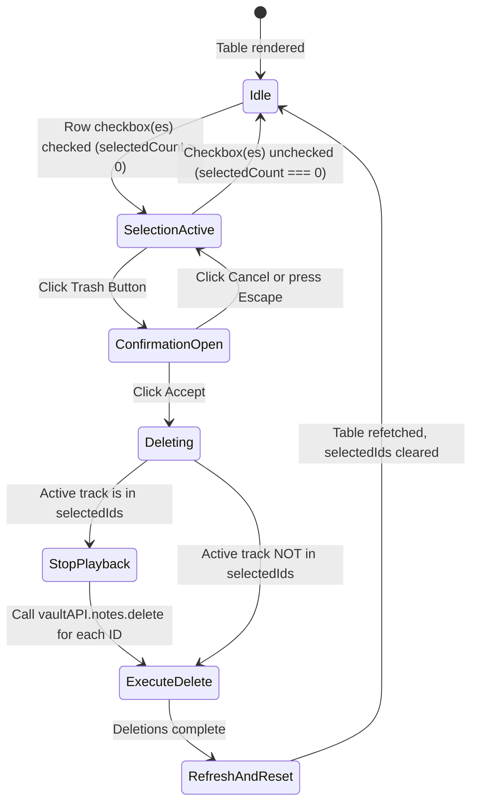

# Phase 1: Data Model & State Specifications

**Feature**: Delete Selected Audio Ideas (Spec 011)  
**Date**: 2026-09-11

## Overview

Deletion interacts with existing SQLite models and physical files via the established `vaultAPI.notes.delete` IPC pipeline. The UI introduces local modal presentation state and batch orchestration.

---

## State Entities

### 1. `DeleteConfirmationState`

| Field | Type | Description |
| :--- | :--- | :--- |
| `isOpen` | `boolean` | Whether the confirmation modal dialog is visible. |
| `isDeleting` | `boolean` | True while deletions are in flight (disables buttons, shows busy indicator). |
| `selectedCount` | `number` | Total number of selected notes targeted for deletion. |

---

## State Transitions

---

## Invariant Rules

- **Zero Deletion Without Confirmation**: Under no circumstance is `vaultAPI.notes.delete` invoked without an explicit "Accept" button click from an open confirmation modal.
- **Playback Safety**: If `currentNote?.id` is among the deleted IDs, audio playback is paused immediately to avoid 404 or stream abort errors on the `vault-audio://` protocol.
- **Post-Delete Selection Pruning**: Selection is explicitly cleared (`clearSelection()`), immediately disabling the trash button (`selectedCount === 0`).
