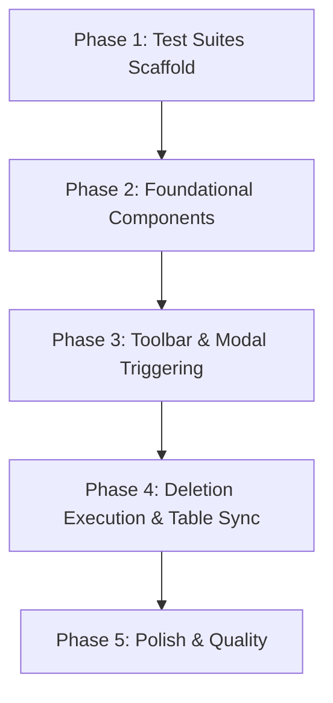

# Tasks: Delete Selected Audio Ideas

**Branch**: `011-delete-audio-ideas` | **Date**: 2026-09-11 | **Spec**: [specs/011-delete-audio-ideas/spec.md](specs/011-delete-audio-ideas/spec.md) | **Plan**: [specs/011-delete-audio-ideas/plan.md](specs/011-delete-audio-ideas/plan.md)

---

## Phase 1: Setup & Tests First

**Purpose**: Scaffold test suites for DeleteButton, DeleteConfirmationModal, and AppLayout integration

- [X] T001 [P] Create unit test suite for `<DeleteButton />` in src/renderer/components/__tests__/DeleteButton.test.tsx
- [X] T002 [P] Create unit test suite for `<DeleteConfirmationModal />` in src/renderer/components/__tests__/DeleteConfirmationModal.test.tsx

---

## Phase 2: Foundational Components

**Purpose**: Implement the standalone `<DeleteButton />` and `<DeleteConfirmationModal />` components

- [X] T003 Implement `<DeleteButton />` with disabled/active states and count badge in src/renderer/components/DeleteButton.tsx
- [X] T004 Implement `<DeleteConfirmationModal />` with warning copy, Accept/Cancel buttons, and Escape dismiss in src/renderer/components/DeleteConfirmationModal.tsx

---

## Phase 3: User Story 1 & 2 - Toolbar Integration & Modal Triggering (Priority: P1) 🎯 MVP

**Goal**: Place the delete button next to TabBar in AppLayout, bind it to active selection state, and trigger the confirmation dialog on click.

**Independent Test**: Render AppLayout with 0 selected ideas (verify trash button is disabled), select 1 idea (verify trash button enables with count "1"), click trash button (verify confirmation modal appears with warning copy and buttons), click Cancel (verify modal closes).

- [X] T005 [US1] Position `<DeleteButton />` next to `<TabBar />` in src/renderer/components/AppLayout.tsx
- [X] T006 [US2] Mount `<DeleteConfirmationModal />` in src/renderer/components/AppLayout.tsx and wire open/close state

---

## Phase 4: User Story 3 - Batch Deletion Execution & Table Sync (Priority: P1)

**Goal**: Execute deletions via `window.vaultAPI.notes.delete` on "Accept", stop audio playback if the active note is deleted, clear selection, and refresh the ideas table.

**Independent Test**: Select 2 ideas, click delete, click Accept, verify notes disappear from table, selection is cleared, and delete button returns to disabled.

- [X] T007 [US3] Implement `handleDeleteConfirm` in src/renderer/components/AppLayout.tsx (handling playback stop, `vaultAPI.notes.delete` calls, `refetch()`, and `clearSelection()`)
- [X] T008 [US3] Add integration tests in src/renderer/components/__tests__/AppLayout.test.tsx verifying the complete delete flow and playback safety

---

## Phase 5: Polish & Quality Verification

**Purpose**: Strict validation, accessibility checks, and full regression test suite run

- [X] T009 [P] Verify keyboard accessibility (`Escape` dismiss, button focus rings) and theme styling in light and dark modes
- [X] T010 Run strict TypeScript type checks across all configs (`tsc --noEmit`)
- [X] T011 Run full Vitest test suite (`npm test`) and ensure zero regressions
- [X] T012 Run production build (`npm run build`)
- [X] T013 Update session log in docs/session_log.md

---

## Dependencies & Execution Order

