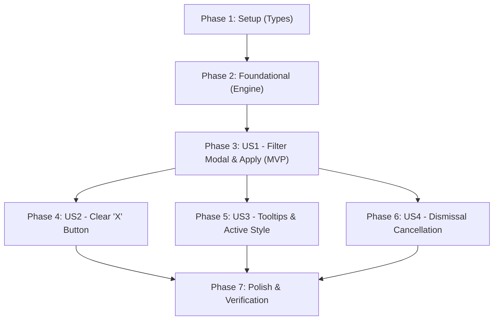

# Implementation Tasks: Filter Ideas Table

**Feature**: `013-filter-ideas-table` | **Date**: 2026-09-15 | **Spec**: [`specs/013-filter-ideas-table/spec.md`](spec.md) | **Plan**: [`specs/013-filter-ideas-table/plan.md`](plan.md)

---

## Phase 1: Setup (Types & Configuration)

**Purpose**: Define the filter criteria data structures, tooltips, and default state.

- [x] T001 [P] Define `IdeaFilterCriteria`, `INITIAL_FILTER_CRITERIA`, and `FILTER_TOOLTIPS` in `src/renderer/types/filters.ts`
- [x] T002 [P] Export filter types and constants from `src/renderer/types/index.ts`

---

## Phase 2: Foundational (Filter Engine & Matching Logic)

**Purpose**: Core in-memory matching functions, tokenization, and empty state support.

**⚠️ CRITICAL**: Must be completed before any user story UI can filter ideas.

- [x] T003 [P] Create unit test suite for tokenization and filtering in `src/renderer/lib/__tests__/filter-ideas.test.ts`
- [x] T004 Implement `parseFilterTokens`, `hasActiveFilters`, `matchesFilterCriteria`, and `filterIdeas` in `src/renderer/lib/filter-ideas.ts` (supporting BPM ranges, case-insensitive partial text, and comma-separated AND logic for authors and instruments)
- [x] T005 [P] Update `<EmptyState />` in `src/renderer/components/EmptyState.tsx` to support filtered zero-match state (`isFiltered`, `onClearFilters`) and update `src/renderer/components/__tests__/EmptyState.test.tsx`

**Checkpoint**: Foundation ready — pure filtering engine tested and ready for UI binding.

---

## Phase 3: User Story 1 - Filter Ideas Modal and Click-Only Apply (Priority: P1) 🎯 MVP

**Goal**: Allow users to open the Filter Modal, configure up to 5 parameter rows with input tooltips, suppress Enter key submission, and apply filters exclusively via a click on the "Apply" button.

**Independent Test**: Open the filter modal, enter BPM range and comma-separated authors/instruments, verify pressing Enter does not submit, click "Apply", and verify the ideas table displays matching notes.

### Tests for User Story 1

- [x] T006 [P] [US1] Create unit test suite for `<FilterModal />` in `src/renderer/components/__tests__/FilterModal.test.tsx` (testing 5 parameter rows, tooltips, Enter key suppression, and onApply callback)
- [x] T007 [P] [US1] Create unit test suite for `<FilterButton />` in `src/renderer/components/__tests__/FilterButton.test.tsx` (testing render, tooltip, and click handler)

### Implementation for User Story 1

- [x] T008 [US1] Implement `<FilterModal />` in `src/renderer/components/FilterModal.tsx` with 5 parameter rows (BPM range, Key, Authors, Section, Instruments), input tooltips, Enter key suppression, draft state, Cancel button, and primary Apply button
- [x] T009 [US1] Implement `<FilterButton />` in `src/renderer/components/FilterButton.tsx` with funnel/filter SVG icon, `"Filter ideas"` tooltip, and click handler
- [x] T010 [US1] Update `<IdeasTable />` in `src/renderer/components/IdeasTable.tsx` to pass `isFiltered` and `onClearFilters` to `<EmptyState />` when filtered results are empty
- [x] T011 [US1] Integrate `FilterModal`, `FilterButton`, and `filterIdeas` into `src/renderer/components/AppLayout.tsx` (computing filtered notes via `useMemo`, mounting toolbar button, and managing modal open/apply state)

**Checkpoint**: At this point, User Story 1 delivers a fully functional MVP allowing users to filter ideas deliberately via the Apply button.

---

## Phase 4: User Story 2 - Instant Filter Clearing via 'X' Button (Priority: P1)

**Goal**: Display an 'X' button in the toolbar whenever filters are active, allowing users to instantly reset all filters without confirmation.

**Independent Test**: Apply a filter, verify the 'X' button appears, click it, and verify all filters clear immediately with full catalog restored and zero confirmation dialogs.

### Tests for User Story 2

- [x] T012 [P] [US2] Create unit test suite for `<ClearFiltersButton />` in `src/renderer/components/__tests__/ClearFiltersButton.test.tsx` (testing render, tooltip, and click handler)

### Implementation for User Story 2

- [x] T013 [US2] Implement `<ClearFiltersButton />` in `src/renderer/components/ClearFiltersButton.tsx` with close `×` SVG icon and `"Clear all filters"` tooltip
- [x] T014 [US2] Integrate `<ClearFiltersButton />` into the toolbar in `src/renderer/components/AppLayout.tsx` (conditionally rendered when `hasActiveFilters` is true, resetting `appliedFilters` to initial state on click)

**Checkpoint**: User Stories 1 AND 2 work seamlessly together, providing instant filter reset.

---

## Phase 5: User Story 3 - Contextual Tooltips and Filter Active Indicators (Priority: P2)

**Goal**: Provide accessible tooltips and clear visual indicators when filtering is active.

**Independent Test**: Hover over Filter and Clear buttons to verify tooltips; verify Filter button displays active styling when filters are applied; verify modal parameter rows display informative formatting tooltips.

### Tests & Refinements for User Story 3

- [x] T015 [P] [US3] Add unit tests in `src/renderer/components/__tests__/FilterButton.test.tsx` verifying active styling classes when `isFiltered === true`
- [x] T016 [P] [US3] Add unit tests in `src/renderer/components/__tests__/FilterModal.test.tsx` verifying that each parameter row and input element displays the expected formatting tooltip
- [x] T017 [US3] Polish visual active indicator styling on `<FilterButton />` (accent background and border) and ensure smooth theme transitions in `src/renderer/components/FilterButton.tsx`

**Checkpoint**: Visual ergonomics and accessibility tooltips fully verified across all themes.

---

## Phase 6: User Story 4 - Seamless Modal Interaction & Dismissal Cancellation (Priority: P2)

**Goal**: Ensure dismissing the modal without clicking "Apply" (Escape key, Close button `×`, or backdrop click) cancels unapplied draft edits.

**Independent Test**: Open modal with active filters, edit a field, press Escape, and verify the table retains prior active filters and the unapplied edit is discarded.

### Tests & Implementation for User Story 4

- [x] T018 [P] [US4] Add unit tests in `src/renderer/components/__tests__/FilterModal.test.tsx` verifying Escape key, Close button, and backdrop click dismissals call `onClose` without calling `onApply`
- [x] T019 [US4] Add integration tests in `src/renderer/components/__tests__/AppLayout.test.tsx` verifying that dismissing the modal preserves the existing applied filter state and discards uncommitted draft values

**Checkpoint**: All 4 user stories are fully implemented and verified independently.

---

## Phase 7: Polish & Cross-Cutting Verification

**Purpose**: Full regression suite, strict type checking, and end-to-end scenario validation.

- [x] T020 [P] Run TypeScript strict type checks across all configs (`npx tsc --noEmit`, `npx tsc -p tsconfig.main.json --noEmit`, `npx tsc -p tsconfig.renderer.json --noEmit`)
- [x] T021 Run full automated test suite via `npm test` to verify zero regressions across existing test suites
- [x] T022 Validate production bundle compilation via `npm run build`
- [x] T023 Execute and verify all 8 validation scenarios from `specs/013-filter-ideas-table/quickstart.md`

---

## Dependencies & Execution Order

### Phase Dependencies

- **Setup (Phase 1)**: No dependencies — can start immediately.
- **Foundational (Phase 2)**: Depends on Phase 1 (types) — blocks all user stories.
- **User Story 1 (Phase 3)**: Depends on Phase 2 completion — delivers core MVP.
- **User Story 2 (Phase 4)**: Depends on Phase 3 completion.
- **User Story 3 (Phase 5)**: Can run in parallel with or following User Stories 1 & 2.
- **User Story 4 (Phase 6)**: Can run in parallel with or following User Story 1.
- **Polish (Phase 7)**: Depends on all user stories being complete.

### User Story Dependencies

---

## Parallel Opportunities

- **Phase 1**: `T001` and `T002` can execute in parallel.
- **Phase 2**: `T003` (tests) and `T005` (empty state) can execute in parallel.
- **Phase 3**: `T006` (modal tests) and `T007` (button tests) can execute in parallel before component implementations.
- **Phase 4**: `T012` (clear button tests) can execute in parallel with `T013`.
- **Phase 5 & 6**: Can execute in parallel once Phase 3 is completed.
- **Phase 7**: `T020` (tsc) can run in parallel with `T021` (vitest).

---

## Implementation Strategy

### MVP First (User Story 1 Only)
1. Complete Phase 1 (Types) & Phase 2 (Filtering Engine).
2. Complete Phase 3 (User Story 1: Filter Modal & Apply button).
3. **Validate MVP**: Filter ideas catalog using the modal and verify table updates cleanly upon clicking "Apply".

### Incremental Delivery
1. Add User Story 2 (`ClearFiltersButton`) → instant reset affordance.
2. Add User Story 3 (Contextual Tooltips & Active styling).
3. Add User Story 4 (Dismissal draft cancellation).
4. Execute Polish & verification phase.
