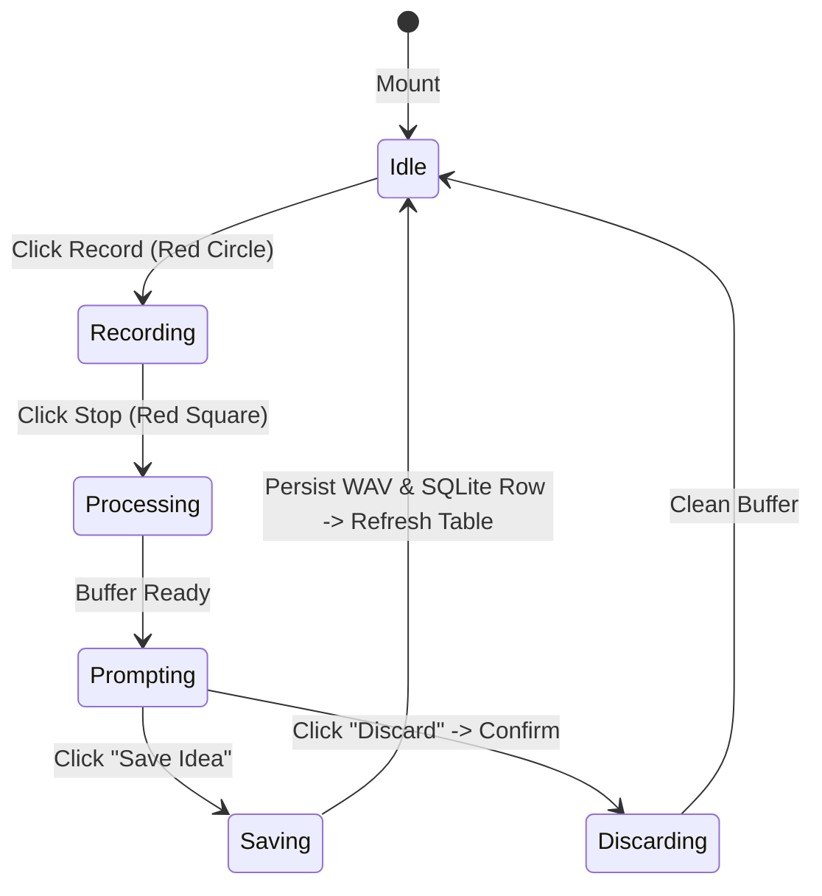

# Data Model: Bottom Recording Dock and Audio Settings

## Entities and Types

### 1. Recording Session State (`RecordingSession`)

Transient state managing an in-flight or freshly completed audio recording take.

```typescript
export type DockRecordingState = 'idle' | 'recording' | 'paused' | 'processing' | 'prompting';

export interface RecordingSession {
  state: DockRecordingState;
  elapsedSeconds: number;
  recordedBuffer: ArrayBuffer | null;
  durationSeconds: number;
  inputGain: number; // 0.0 to 2.0 (default 1.0)
  outputVolume: number; // 0.0 to 1.0 (default 1.0)
  error: string | null;
}
```

### 2. Audio Hardware Configuration (`AudioHardwareSettings`)

Persistent user hardware preferences stored in `localStorage`.

```typescript
export type ChannelMode = 'stereo' | 'mono-ch1' | 'mono-ch2';

export interface AudioHardwareSettings {
  inputDeviceId: string; // 'default' or device UUID
  outputDeviceId: string; // 'default' or device UUID
  channelMode: ChannelMode;
  inputGain: number; // 0.0 to 2.0
  outputVolume: number; // 0.0 to 1.0
}

export interface AudioDeviceOption {
  deviceId: string;
  label: string;
  isDefault: boolean;
  kind: 'audioinput' | 'audiooutput';
}
```

### 3. Post-Recording Metadata Form Input (`PostRecordingIdeaInput`)

Data model collected by `<SaveIdeaModal />` upon stopping a recording session.

```typescript
export interface PostRecordingIdeaInput {
  title: string; // Optional: empty string triggers default 'Idea-XX'
  musical_key?: string; // Optional: e.g. "C Major", "A Minor"
  bpm?: number | null; // Optional: positive number
  authors?: string; // Optional: comma-separated string
  song_section?: string; // Optional: "Verse", "Chorus", etc.
  instruments?: string; // Optional: comma-separated string
  notes?: string; // Optional: free-form text
}
```

### 4. Volume Meter State (`MeterSignalLevels`)

Instantaneous signal measurements used to drive `<VolumeMeter />` components.

```typescript
export interface MeterSignalLevels {
  rms: number; // 0.0 to 1.0 (root mean square energy)
  peak: number; // 0.0 to 1.0 (highest instantaneous sample)
  isClipping: boolean; // true if peak >= 0.99
}
```

---

## State Transitions



1. **Idle**: Record button is a red circle. Real-time input meter displays live ambient microphone input. Knobs are adjustable.
2. **Recording**: Record button is a red square. Live elapsed timer counts up from 00:00. Playback is halted. Input meter shows recorded signal.
3. **Processing**: Final WAV chunks assembled into linear PCM buffer.
4. **Prompting**: `<SaveIdeaModal />` open. Backdrop/Escape dismiss is disabled. User fills optional fields.
5. **Saving**: Audio saved via `saveAudioFile`, note created via `notes.create`, catalog refreshed, returns to Idle.
6. **Discarding**: Buffer freed, modal closed, returns to Idle.
