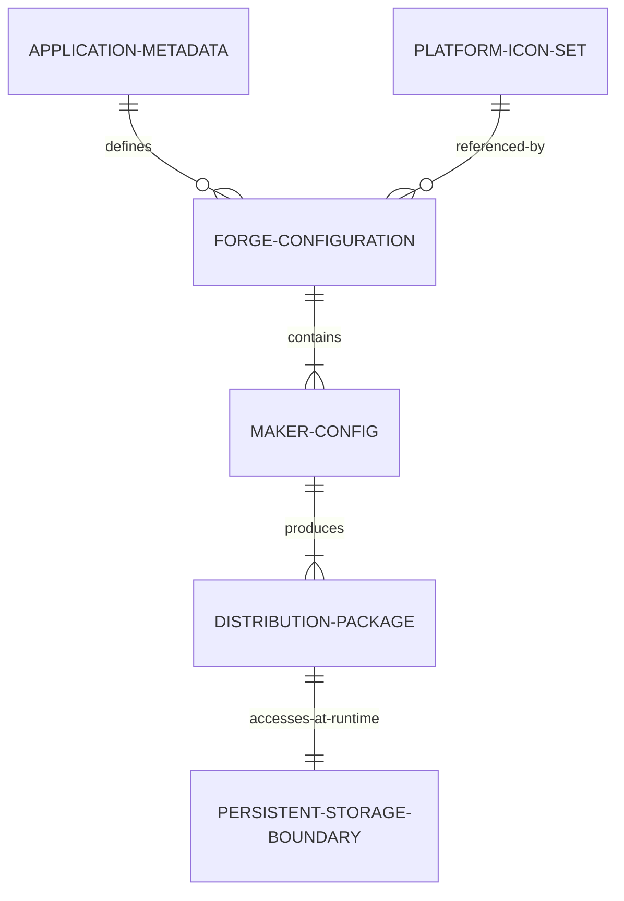

# Data Model: Desktop Application Packaging

**Feature**: Desktop Application Packaging for macOS and Windows (`015-app-packaging`)  
**Date**: 2026-09-16  
**Status**: Draft

---

## Entities Overview

---

## 1. Application Metadata Profile

Encapsulates all identity, branding, and platform registration attributes for the packaged desktop application.

| Field | Type | Description | Validation / Constraints |
|---|---|---|---|
| `name` | `string` | Internal package name | `^[a-z0-9-_]+$`, e.g. `"vault"` |
| `productName` | `string` | Human-readable application title | Displayed on window, dock, and installer. Value: `"Vault"` |
| `executableName` | `string` | Platform binary executable name | No spaces recommended on Windows. Value: `"Vault"` |
| `appId` | `string` | Reverse-DNS bundle identifier | Format: `com.domain.app`, e.g. `"com.vault.app"` |
| `version` | `string` | SemVer version string | Semantic versioning format `X.Y.Z`, e.g. `"0.1.0"` |
| `description` | `string` | Short app summary | Human-readable string |
| `author` | `string` | Author / developer name | Human-readable string |
| `copyright` | `string` | Copyright statement | Format: `Copyright © {YEAR} {AUTHOR}` |

---

## 2. Platform Icon Set

Manages multi-resolution graphic assets formatted specifically for operating system shells and window managers.

| Field | Type | Format / Path | Description |
|---|---|---|---|
| `sourcePng` | `string` | `assets/VaultLogo.png` | 1024x1024 high-resolution RGBA PNG source |
| `macIcon` | `string` | `assets/VaultLogo.icns` | Apple Icon Image containing 16x16 through 1024x1024 Retina resolutions |
| `winIcon` | `string` | `assets/VaultLogo.ico` | Windows Icon Resource containing 16x16, 32x32, 48x48, and 256x256 resolutions |
| `basePath` | `string` | `./assets/VaultLogo` | Extensionless icon base path passed to Electron Packager |

---

## 3. Forge Configuration Entity

Encapsulates packaging instructions, file inclusion filters, native module rebuild parameters, and maker plugins.

| Field | Type | Description |
|---|---|---|
| `packagerConfig` | `ForgePackagerOptions` | Configuration for Electron Packager (`name`, `executableName`, `icon`, `appBundleId`, `ignore`, `asar`) |
| `packagerConfig.asar` | `boolean \| object` | Whether to package code into ASAR archives. Set to `true` (with `unpack: "**/better-sqlite3/**"` for native binaries) |
| `packagerConfig.ignore` | `RegExp[] \| Function` | Exclusion filter for non-production directories (`src`, `specs`, `tests`, etc.) |
| `rebuildConfig` | `object` | Native module recompilation settings (`onlyModules: ['better-sqlite3']`) |
| `makers` | `ForgeMakerConfig[]` | List of target installer generators |
| `hooks` | `ForgeHooks` | Lifecycle hooks (`prePackage: ['npm run build']`) |

---

## 4. Maker Config & Distribution Package

Represents an individual target installer configuration and the resulting compiled output artifact.

| Field | Type | Example / Values | Description |
|---|---|---|---|
| `platform` | `'darwin' \| 'win32'` | Target operating system | Operating system target |
| `arch` | `'arm64' \| 'x64' \| 'universal'` | Target CPU architecture | Target hardware architecture |
| `makerType` | `'dmg' \| 'squirrel' \| 'zip'` | Maker plugin identifier | Maker implementation used |
| `artifactName` | `string` | `Vault-0.1.0-arm64.dmg` | Output filename template |
| `outputDir` | `string` | `out/make/...` | Destination directory on disk |
| `requiresAdmin` | `boolean` | `false` | Windows installers install per-user without requiring admin credentials |

### Supported Packaging Matrix

| Platform | Arch | Maker Plugin | Output Artifact | Description |
|---|---|---|---|---|
| **macOS** | `arm64` | `@electron-forge/maker-dmg` | `out/make/Vault-0.1.0-arm64.dmg` | Drag-to-Applications installer for Apple Silicon |
| **macOS** | `x64` | `@electron-forge/maker-dmg` | `out/make/Vault-0.1.0-x64.dmg` | Drag-to-Applications installer for Intel Macs |
| **macOS** | `arm64` / `x64` | `@electron-forge/maker-zip` | `out/make/zip/darwin/.../Vault-darwin-*.zip` | Standalone compressed `.app` bundle |
| **Windows** | `x64` | `@electron-forge/maker-squirrel` | `out/make/squirrel.windows/x64/Vault-0.1.0-Setup.exe` | Standard Windows Setup Wizard |
| **Windows** | `x64` | `@electron-forge/maker-zip` | `out/make/zip/win32/x64/Vault-win32-x64-*.zip` | Portable executable archive |

---

## 5. Persistent Storage Boundary

Defines where the packaged application creates and persists its application data at runtime across installs and updates.

| Platform | `app.getPath('userData')` Resolution | SQLite Database Path | Audio Vault Path |
|---|---|---|---|
| **macOS** | `~/Library/Application Support/Vault/` | `~/Library/Application Support/Vault/vault.db` | `~/Library/Application Support/Vault/audio_vault/` |
| **Windows** | `%APPDATA%\Vault\` | `%APPDATA%\Vault\vault.db` | `%APPDATA%\Vault\audio_vault\` |

**Data Integrity Invariant**: All files within `userData` are strictly independent of the application bundle binaries in `/Applications` or `%LOCALAPPDATA%\Programs\Vault`. Overwriting, updating, or reinstalling the application binary leaves `userData` 100% intact.
