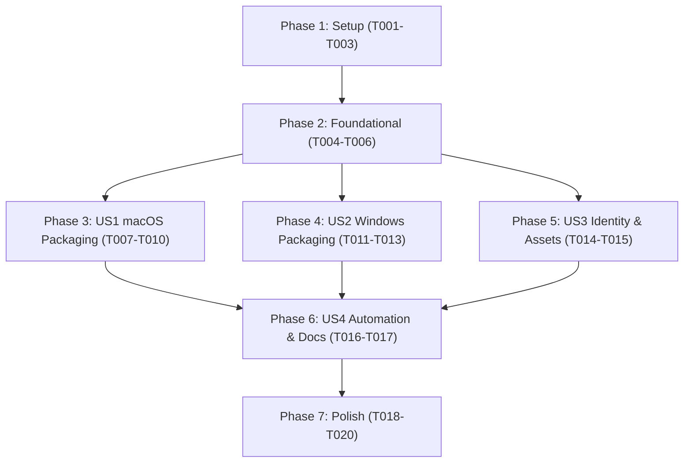

# Tasks: Desktop Application Packaging for macOS and Windows

**Feature**: Desktop Application Packaging for macOS and Windows (`015-app-packaging`)  
**Input**: Plan from [`specs/015-app-packaging/plan.md`](./plan.md) and Spec from [`specs/015-app-packaging/spec.md`](./spec.md)  
**Status**: Ready for Implementation

---

## Phase 1: Setup (Shared Infrastructure)

**Purpose**: Tooling installation and icon asset generation infrastructure.

- [X] T001 Install Electron Forge dependencies (`@electron-forge/cli`, `@electron-forge/maker-dmg`, `@electron-forge/maker-squirrel`, `@electron-forge/maker-zip`, `@electron-forge/shared-types`) as `devDependencies` in `package.json`
- [X] T002 [P] Create macOS icon generation script `scripts/generate-icns.sh` using native `sips` and `iconutil`
- [X] T003 Execute `scripts/generate-icns.sh` to generate multi-resolution Apple icon container `assets/VaultLogo.icns` from `assets/VaultLogo.png`

---

## Phase 2: Foundational (Blocking Prerequisites)

**Purpose**: Core packaging configuration and build pipeline hooks that MUST be complete before platform makers run.

**⚠️ CRITICAL**: No maker/distribution work can begin until this phase is complete.

- [X] T004 Create `forge.config.cjs` with base `packagerConfig` (app metadata, bundle ID, icon base path, ASAR unpack for `better-sqlite3`, and non-production ignore filters) and `rebuildConfig` for `better-sqlite3`
- [X] T005 Update `package.json` adding packaging scripts (`package`, `make`, `make:mac`, `make:win`)
- [X] T006 Verify production compilation of main and renderer bundles via `npm run build` outputting to `dist/`

**Checkpoint**: Base packaging pipeline established — platform maker implementations can now begin.

---

## Phase 3: User Story 1 - Package and Distribute for macOS (Priority: P1) 🎯 MVP

**Goal**: Deliver installable `.dmg` and portable `.zip` packages for macOS supporting Apple Silicon and Intel architectures, verified with standalone offline launch.

**Independent Test**: Run `npm run make:mac`, verify `out/make/Vault-*.dmg` mounts showing the Vault icon and Applications shortcut, and launch `out/Vault-darwin-*/Vault.app` standalone without dev servers, confirming audio recording, playback, and SQLite database persistence operate cleanly.

- [X] T007 [US1] Configure `@electron-forge/maker-dmg` in `forge.config.cjs` with drag-to-Applications window dimensions and icon layout
- [X] T008 [US1] Configure `@electron-forge/maker-zip` for `darwin` platform in `forge.config.cjs`
- [X] T009 [US1] Execute `npm run make:mac` to generate macOS DMG and ZIP distribution packages in `out/make/`
- [X] T010 [US1] Verify standalone execution of the packaged application bundle in `out/Vault-darwin-*/Vault.app` with dev servers stopped, verifying database initialization and offline UI loading

**Checkpoint**: User Story 1 complete — Vault can be distributed and installed on macOS.

---

## Phase 4: User Story 2 - Package and Distribute for Windows (Priority: P1)

**Goal**: Deliver standard Windows installer (`Setup.exe`) and portable `.zip` package with desktop and Start Menu shortcuts, per-user installation without admin rights, and clean uninstallation.

**Independent Test**: Verify Windows maker configuration in `forge.config.cjs`, run `npm run make:win`, and verify CI workflow produces Windows executables with custom taskbar icon and clean desktop integration.

- [X] T011 [US2] Configure `@electron-forge/maker-squirrel` in `forge.config.cjs` with `setupExe: 'Vault-Setup.exe'`, `setupIcon: './assets/VaultLogo.ico'`, and shortcut options
- [X] T012 [US2] Configure `@electron-forge/maker-zip` for `win32` platform in `forge.config.cjs` for portable Windows distribution
- [X] T013 [US2] Create GitHub Actions CI workflow `.github/workflows/package.yml` with a build matrix (`macos-latest` and `windows-latest`) to compile native Windows and macOS packages in the cloud

**Checkpoint**: User Story 2 complete — Windows installers and cloud build automation ready.

---

## Phase 5: User Story 3 - Application Identity, Branding, and Visual Assets (Priority: P2)

**Goal**: Display custom Vault branding across all platform surfaces (macOS Dock, Windows Taskbar, About dialog, and window title bar).

**Independent Test**: Launch packaged application and verify that Dock, Taskbar, and window frames display the crisp custom Vault logo instead of default Electron placeholders.

- [X] T014 [P] [US3] Update `src/main/index.ts` to configure `BrowserWindow` `icon` option pointing to `assets/VaultLogo.png` for runtime window and taskbar representation
- [X] T015 [US3] Validate application metadata (Product Name "Vault", version `0.1.0`, bundle ID `com.vault.app`) in `forge.config.cjs` and `package.json`

**Checkpoint**: User Story 3 complete — Vault has a consistent, professional branded identity across operating systems.

---

## Phase 6: User Story 4 - Automated Multi-Platform Packaging Commands (Priority: P2)

**Goal**: Provide convenient, reliable packaging commands and distribution documentation.

**Independent Test**: Execute `npm run package` from a clean repository state and confirm pre-packaging builds trigger automatically without manual intervention.

- [X] T016 [US4] Configure pre-package build chaining in `package.json` to ensure `npm run build` executes automatically prior to packaging
- [X] T017 [US4] Author distribution guide in `docs/distribution.md` documenting local packaging commands, GitHub Actions workflow usage, and bypass procedures for unsigned macOS Gatekeeper and Windows SmartScreen warnings

**Checkpoint**: User Story 4 complete — Packaging commands and distribution docs fully established.

---

## Phase 7: Polish & Cross-Cutting Concerns

**Purpose**: Workspace hygiene, regression testing, and quickstart scenario verification.

- [X] T018 Update `.gitignore` to ensure packaging build outputs (`out/`, `dist-packages/`, and temporary `.iconset` directories) are excluded from git
- [X] T019 Run full test suite via `npm test` to verify all 325 unit and integration tests pass without regression
- [X] T020 Execute quickstart validation scenarios from `specs/015-app-packaging/quickstart.md` to confirm end-to-end packaging functionality

---

## Dependencies & Execution Order

### Phase Dependencies

### User Story Dependencies

- **Setup (Phase 1)**: No dependencies — installs Forge and generates `.icns`.
- **Foundational (Phase 2)**: Depends on Phase 1 — blocks all user stories.
- **US1 (macOS Packaging)**: Depends on Foundational — can be executed and tested locally on macOS immediately.
- **US2 (Windows Packaging)**: Depends on Foundational — maker config and GitHub Actions CI workflow.
- **US3 (Identity & Assets)**: Can run in parallel with US1/US2.
- **US4 (Commands & Docs)**: Depends on US1, US2, and US3.
- **Polish (Phase 7)**: Depends on all stories.

---

## Parallel Opportunities

- `T002` (icon script) can run in parallel with `T001` (dependency installation).
- Once Foundational completes:
  - `T007`-`T008` (macOS makers) and `T011`-`T012` (Windows makers) can be configured concurrently in `forge.config.cjs`.
  - `T014` (window icon update in `src/main/index.ts`) can run in parallel with maker tasks.

---

## Implementation Strategy

### MVP First (User Story 1 - macOS Packaging)

1. Complete **Phase 1: Setup** (install Forge, generate `.icns`).
2. Complete **Phase 2: Foundational** (create `forge.config.cjs`, configure scripts, build `dist/`).
3. Complete **Phase 3: User Story 1** (macOS DMG & ZIP).
4. **VALIDATE MVP**: Open `out/make/Vault-*.dmg`, install, launch `Vault.app` standalone, record and play audio.

### Incremental Delivery

1. Setup + Foundational -> Packaging foundation ready.
2. US1 -> macOS distributables available (MVP!).
3. US2 -> Windows maker config and GitHub Actions cross-platform CI runner workflow ready.
4. US3 -> Runtime window and taskbar branding verified.
5. US4 + Polish -> Automated scripts, distribution documentation, and clean workspace.
